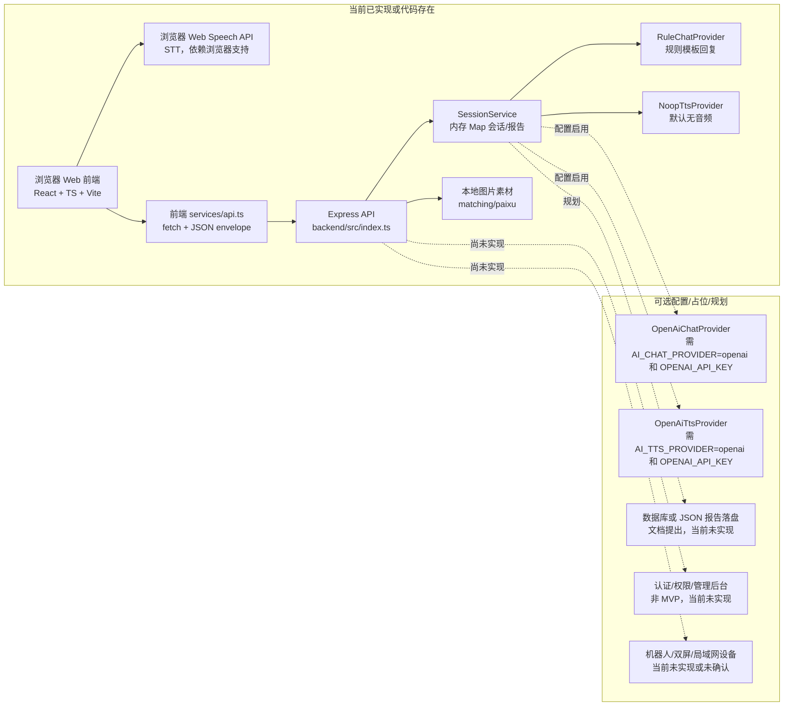
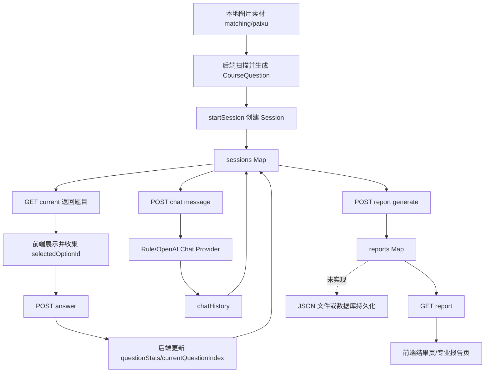

# 项目上下文与现状审查报告

## 1. 文档元信息

| 项目 | 内容 |
| -- | -- |
| 审查日期 | 2026-06-06 |
| 仓库名称 | `Project`（Git 根目录：`D:/For Study/MyProjectRelated/Project/2026_DEMO_Robot/Project`） |
| 当前分支 | `main` |
| 当前 commit hash | `df5147b9c9d8eb1173ce23cf63bc6267f97e1125` |
| 工作区状态 | 存在未跟踪文件：`docs/评估报告/`、`professional_report_ver2.html`；报告反映当前工作区状态，不只代表当前 commit |
| 审查范围 | 根目录静态 HTML、`frontend/`、`backend/`、`docs/`、`matching/`、`paixu/`、根级 `package.json`、Git 状态和最近提交 |
| 未能审查内容 | 未审查真实 `.env` 值；未连接外部 OpenAI 服务；未使用真实硬件、真实儿童用户、局域网设备或双屏设备验证 |
| 子 Agent | 子 Agent 1 前端审查；子 Agent 2 后端审查；子 Agent 3 架构、部署与质量审查；子 Agent 4 产品需求与完成度审查 |
| 证据标记 | `[代码确认]`、`[配置确认]`、`[文档描述]`、`[运行验证]`、`[未确认]`、`[推测]` |

实际执行过的验证命令：

| 命令 | 结果 | 备注 |
| -- | -- | -- |
| `git status --short --branch` | 成功 | 当前分支 `main`，存在未跟踪文件 |
| `git rev-parse HEAD` | 成功 | 当前 hash 为 `df5147b9c9d8eb1173ce23cf63bc6267f97e1125` |
| `rg --files` | 成功 | 枚举主要源码、文档、素材文件 |
| `npm run build` | 成功 | 后端 `tsc -p tsconfig.json` 成功；前端 `tsc -b && vite build` 成功 |
| PowerShell 启动 `node backend/dist/index.js` 并调用 API | 成功 | `/api/health`、`/api/session/start`、`/api/course/:sessionId/current`、`/api/chat/:sessionId/message` 冒烟通过；随后停止进程 |
| `rg -n "TODO|FIXME|..."` 首次全局宽泛搜索 | 退出码 1 | 未返回匹配；后续限定路径与关键词搜索成功 |

执行失败或未执行的验证：

| 命令或验证 | 状态 | 原因 |
| -- | -- | -- |
| `npm test` | 未执行 | 根、前端、后端 `package.json` 未提供 `test` 脚本 |
| `npm run lint` | 未执行 | 未发现 lint 脚本或 ESLint 配置 |
| 浏览器端完整点击流程 | 未执行 | 本次主要通过代码和 API 冒烟验证；未启动前端浏览器自动化 |
| OpenAI Chat/TTS 调用 | 未执行 | 需要真实 API key，可能产生外部调用和费用 |
| 语音识别、音频播放 | 未执行 | 依赖浏览器 Web Speech API、音频设备和运行环境 |
| 局域网、多设备、双屏、机器人硬件 | 未执行 | 仓库未提供对应硬件或外部设备连接 |

## 2. 项目概述

[文档描述] `docs/PRD.md` 将项目定义为“儿童教育互动训练 Demo - PRD（MVP）”，目标是构建面向 6-10 岁儿童、可独立操作、可完整演示的互动训练系统 MVP。主流程是儿童从进入页面到完成训练并生成评估报告的闭环。

[代码确认] 当前代码实际呈现为本机演示型 Web MVP：`frontend/` 是 React + TypeScript + Vite 单页应用；`backend/` 是 Node.js + Express + TypeScript API 服务；本地图片素材在 `matching/` 和 `paixu/`；根目录还保留多个静态 HTML 原型。

目标用户：

| 用户 | 当前证据 | 完成度 |
| -- | -- | -- |
| 6-10 岁儿童 | `docs/PRD.md` 明确；前端 UI 文案、训练交互面向儿童 | 基本完成儿童端演示闭环 |
| 演示者/开发者 | `README.md`、`docs/DEMO_RUNBOOK.md` 提供本地启动与演示步骤 | 基本完成本地演示支持 |
| 教师/家长/管理端 | 文档未列为 MVP 目标；代码未发现独立后台 | 尚未实现 |
| 机器人/双屏设备 | 项目路径和后续文档暗示可能相关，但当前代码未提供真实机器人控制或双屏通信 | 未实现或未确认 |

文档描述的项目与代码实际项目差异：

| 主题 | 文档描述 | 当前代码实际状态 |
| -- | -- | -- |
| MVP 阶段 | `README.md` 写 Phase 4 验收与演示已完成 | 构建与 API 冒烟通过，核心闭环具备；但浏览器端完整流程未在本次验证 |
| 前端地址 | `README.md`、`docs/DEMO_RUNBOOK.md` 写 `127.0.0.1:5173` | `frontend/vite.config.ts` 实际配置 `127.0.0.1:5175` |
| 存储 | `docs/PRD.md` 建议“内存 + JSON 文件落盘” | `backend/src/services/sessionService.ts` 使用内存 `Map`，未发现 JSON 落盘 |
| 语音/模型 | `README.md` 写语音输入与语音回复、模型服务暂未实现 | 前端已有浏览器 `SpeechRecognition`；后端已有 OpenAI Chat/TTS provider 框架，但默认规则回复和无 TTS |
| 架构分层 | `docs/ARCHITECTURE.md` 规划 routes/controllers/repositories/engine 等 | 实际路由集中在 `backend/src/index.ts`，核心业务集中在 `backend/src/services/sessionService.ts` |

当前仓库在整个系统中的角色：本仓库是一个本地 Web Demo 主仓库，包含前端、后端、文档、演示素材和旧静态原型。未发现另一个机器人端、Android 端、Windows 桌面端或后台管理端代码。

## 3. 核心业务流程

### 3.1 儿童训练闭环

1. 用户进入前端应用。
   - 状态：`[代码确认]` 已实现欢迎页状态 `welcome`，位置 `frontend/src/App.tsx`。
2. 用户开始训练并进入课程选择。
   - 状态：`[代码确认]` 页面状态 `select` 存在；但 `docs/DEMO_RUNBOOK.md` 写“输入儿童昵称”，当前 `App.tsx` 中未确认存在昵称输入框，`childName` 默认是“小朋友”。
3. 用户选择课程。
   - 状态：`[代码确认]` `COURSE_OPTIONS` 硬编码 `matching` 与 `ordering`；前端支持多选课程队列。
4. 前端调用 `POST /api/session/start`。
   - 状态：`[运行验证]` 已通过 API 冒烟，返回 `TRAINING_ACTIVE`。
5. 后端根据课程类型生成题目。
   - 状态：`[代码确认]` `buildMatchingQuestions()` 扫描 `matching/` 图片；`buildOrderingQuestions()` 扫描 `paixu/` 图片并解析级别。
6. 前端调用 `GET /api/course/:sessionId/current` 获取当前题。
   - 状态：`[运行验证]` 冒烟返回 `matching_q_1` 和 4 个选项。
7. 用户点击选项，前端调用 `POST /api/course/:sessionId/answer`。
   - 状态：`[代码确认]` 后端按 `selectedOptionId === correctOptionId` 判题，正确则推进索引，错误则累计错误次数。
8. 错误反馈和提示。
   - 状态：`[代码确认]` 同题错误 `attempts >= 2` 时返回 `hint`；单题超时提醒未发现实际触发逻辑。
9. 训练中对话。
   - 状态：`[运行验证]` `POST /api/chat/:sessionId/message` 可返回规则 provider 回复；未调用真实 LLM。
10. 完成课程后生成报告。
    - 状态：`[代码确认]` 前端完成最后一题后调用 `generateReport()` 与 `getReport()`；后端报告保存在内存 `reports`。
11. 前端展示结果页和专业报告详情页。
    - 状态：`[代码确认]` `report` 与 `reportDetail` 页面存在；专业报告中部分常模/百分位/诊断文案缺少真实评估标准支撑，属于演示性内容。

### 3.2 多课程流程

[代码确认] 当前 `App.tsx` 支持 `selectedCourses`、`courseQueue`、`activeCourseIndex`，会按 `COURSE_OPTIONS` 顺序依次启动多个课程，并用 `mergeTrainingReports()` 在前端合并报告。后端本身仍是一门课程一个 session，没有后端层面的多课程总会话模型。

### 3.3 语音与模型流程

1. 前端浏览器尝试创建 `SpeechRecognition` 或 `webkitSpeechRecognition`。
   - 状态：`[代码确认]` 存在；依赖浏览器支持。
2. 识别到文本后调用 `sendChatMessage()`。
   - 状态：`[代码确认]` 训练页内可发送文本。
3. 后端 `runVoiceAssistant()` 调 Chat provider，再调 TTS provider。
   - 状态：`[代码确认]` 默认 `rule` + `none`；OpenAI provider 仅在环境变量配置后启用。
4. 前端如收到 `audioBase64` 和 `audioMimeType` 则播放音频。
   - 状态：`[代码确认]` 代码存在；`[未确认]` 未验证真实音频播放。

## 4. 系统边界与终端构成

| 终端或模块 | 运行平台 | 技术栈 | 主要职责 | 当前实现程度 | 通信方式 | 代码目录 |
| -- | -- | -- | -- | -- | -- | -- |
| Web 儿童端 | 浏览器，本机优先 | React 18、TypeScript、Vite、CSS | 欢迎、选课、训练、结果、报告详情、语音面板 | 基本完成 Demo 闭环 | HTTP `fetch` 到后端；浏览器 Web Speech API | `frontend/` |
| 后端服务 | Node.js，本机 | Express 4、TypeScript、Zod、dotenv | API、会话、题目生成、判题、报告、对话 provider | 基本完成 Demo API | HTTP JSON；静态文件服务 | `backend/` |
| 静态素材 | 本地文件 | 图片资源 | `matching` 和 `paixu` 课程题目素材 | 已被后端扫描使用 | 后端 `express.static` 暴露 | `matching/`、`paixu/` |
| 文档体系 | Markdown/PDF | PRD、API、流程、验收、语音模型指南 | 需求和交接资料 | 已存在，但部分与代码不一致 | 不适用 | `docs/` |
| 静态 HTML 原型 | 浏览器 | HTML/CSS/JS | 早期页面/报告原型 | 非当前主实现，部分演示或历史页面 | 静态页面内逻辑 | 根目录 `Home.html` 等 |
| 管理端/教师端/家长端 | 未确认 | 未确认 | 后台配置、长期查看报告等 | 未实现 | 未确认 | 未发现 |
| 机器人端/双屏/外部硬件 | 未确认 | 未确认 | 硬件互动、机器人控制、双屏显示 | 未实现或不在本仓库 | 未确认 | 未发现 |
| Android/Windows 应用 | 未确认 | 未确认 | 移动端或桌面端 | 未实现 | 未确认 | 未发现 |

## 5. 总体技术架构

架构说明：

- `[代码确认]` 前后端通过 HTTP JSON 通信，没有 WebSocket/SSE。
- `[代码确认]` 后端服务静态暴露 `/matching` 和 `/paixu`。
- `[代码确认]` 后端会话与报告均为进程内 `Map`。
- `[配置确认]` 默认 AI Chat provider 为 `rule`，TTS provider 为 `none`。
- `[未确认]` 未验证局域网、多设备、硬件或双屏能力。

## 6. 仓库目录结构

| 路径 | 作用 | 当前状态 | 备注 |
| -- | -- | -- | -- |
| `frontend/` | 当前 React 儿童端主应用 | 主实现 | `App.tsx` 集中了页面、状态和交互 |
| `frontend/src/App.tsx` | 前端主组件 | 主实现 | 页面状态、课程队列、语音、报告都在此文件 |
| `frontend/src/services/api.ts` | API 请求封装 | 主实现 | API Base URL 硬编码 `http://127.0.0.1:3001/api` |
| `frontend/src/services/trainingService.ts` | 训练 API 封装 | 主实现 | 开始会话、取题、答题、报告、聊天 |
| `frontend/src/types/index.ts` | 前端类型 | 主实现 | 包含 `AppPage`、`CourseType`、`TrainingReport` |
| `backend/` | Express 后端服务 | 主实现 | API、会话、报告、provider |
| `backend/src/index.ts` | 后端入口和所有 API 路由 | 主实现 | 监听 `127.0.0.1:3001`，CORS 全开放 |
| `backend/src/services/sessionService.ts` | 核心业务服务 | 主实现 | 题目生成、判题、报告、聊天历史 |
| `backend/src/services/voice/` | 语音/模型 provider 框架 | 部分实现 | 默认规则/无 TTS；OpenAI provider 可配置启用 |
| `backend/src/config/runtime.ts` | 环境变量读取与校验 | 主实现 | 只校验 provider 为 OpenAI 时 key 是否存在 |
| `backend/src/schemas/requestSchemas.ts` | 请求 Zod 校验 | 主实现 | 开始会话、答题、聊天 |
| `backend/src/data/` | 静态题库常量 | 疑似遗留或示例 | 当前主流程由 `sessionService.ts` 扫描素材生成题目 |
| `matching/` | 配对课程素材 | 被使用 | 后端扫描图片生成 matching 题目 |
| `paixu/` | 排序课程素材 | 被使用 | 后端扫描分类目录生成 ordering 题目 |
| `docs/` | PRD、架构、API、流程、验收、语音指南 | 文档存在 | 与当前代码存在若干差异 |
| `docs/评估报告/` | 评估报告 PDF 资料 | 未跟踪 | 当前 Git 状态显示未跟踪 |
| 根目录 `*.html` | 静态 HTML 原型 | 历史/演示文件 | 与 `frontend/` 主应用并存，容易造成入口混淆 |
| `backend/dist/`、`frontend/dist/` | 构建产物 | 存在且被 `.gitignore` 忽略 | 本次 `npm run build` 成功 |
| `node_modules/` | 依赖目录 | 存在 | `.gitignore` 忽略 |

## 7. 技术栈与依赖

### 7.1 前端

| 类别 | 内容 | 来源 |
| -- | -- | -- |
| 框架 | React 18、React DOM 18 | `frontend/package.json` |
| 语言 | TypeScript | `frontend/package.json`、`frontend/tsconfig.json` |
| 构建工具 | Vite 5、`@vitejs/plugin-react` | `frontend/package.json`、`frontend/vite.config.ts` |
| UI 库 | 未发现第三方 UI 组件库 | 代码扫描 |
| 状态管理 | React 内置 `useState/useMemo/useRef/useEffect` | `frontend/src/App.tsx` |
| 网络请求 | 原生 `fetch` | `frontend/src/services/api.ts` |
| 语音输入 | 浏览器 `SpeechRecognition` / `webkitSpeechRecognition` | `frontend/src/App.tsx` |
| 音频播放 | `new Audio(data:...)` | `frontend/src/App.tsx` |

### 7.2 后端

| 类别 | 内容 | 来源 |
| -- | -- | -- |
| 框架 | Express 4 | `backend/package.json` |
| 语言 | TypeScript + ESM | `backend/package.json`、`backend/tsconfig.json` |
| 请求校验 | Zod | `backend/src/schemas/requestSchemas.ts` |
| CORS | `cors`，当前全开放 | `backend/src/index.ts` |
| 配置 | `dotenv` | `backend/src/config/runtime.ts` |
| ORM/数据库 | 未发现 | `backend/package.json` 和代码扫描 |
| 鉴权 | 未发现 JWT、cookie session、Passport、bcrypt 等 | 代码扫描 |
| AI SDK | 未使用官方 SDK，使用 `fetch` 直接调用 OpenAI HTTP 接口 | `openAiChatProvider.ts`、`openAiTtsProvider.ts` |
| 实时通信 | 未发现 WebSocket/SSE | 依赖和代码扫描 |

### 7.3 基础设施

| 类别 | 当前状态 | 证据 |
| -- | -- | -- |
| Docker | 未发现 | 未发现 `Dockerfile` 或 `docker-compose` |
| Web 服务器 | 开发期 Vite + Node Express | `package.json` |
| 反向代理 | 未发现 | 代码扫描 |
| CI/CD | 未发现 | 未发现 `.github` workflow 等 |
| 操作系统要求 | 文档写 Node.js 18+，建议 20+ | `docs/DEMO_RUNBOOK.md` |
| 硬件要求 | 未明确 | 未发现硬件接口代码 |
| 外部服务 | OpenAI 可选，需要环境变量 | `backend/.env.example` |

## 8. 前端实现现状

| 页面或模块 | 路径/路由 | 主要功能 | 数据来源 | 完成状态 | 证据文件 | 已知问题 |
| -- | -- | -- | -- | -- | -- | -- |
| 欢迎页 | `page === "welcome"` | 进入训练 | 前端状态 | 基本完成 | `frontend/src/App.tsx` | 文档写可输入儿童昵称，但当前未确认输入框存在 |
| 课程选择页 | `page === "select"` | 选择 `matching`/`ordering`，支持多选 | `COURSE_OPTIONS` 硬编码 | 基本完成 | `frontend/src/App.tsx` | 课程配置未后台化 |
| 训练页 | `page === "training"` | 展示题目、选项、反馈、提示、课程进度 | 后端 API + 静态素材 URL | 基本完成 | `frontend/src/App.tsx` | 逻辑集中在单文件；单题超时提醒未发现 |
| 结果页 | `page === "report"` | 总结星级、速度、错误、正确率、进入报告详情 | 后端报告或前端合并报告 | 基本完成 | `frontend/src/App.tsx` | 多课程合并在前端完成 |
| 专业报告页 | `page === "reportDetail"` | 横/竖版报告、打印、KPI、雷达图、建议 | 训练报告 + 前端派生/硬编码文案 | 原型/演示实现 | `frontend/src/App.tsx` | 常模、同龄百分位、专家建议缺少真实评估标准支撑 |
| 语音面板 | 非 welcome/reportDetail 页面 | 单次/持续语音捕捉、语音日志、后端对话、音频播放 | 浏览器 STT + 后端 chat API | 部分实现 | `frontend/src/App.tsx` | 依赖浏览器支持；未验证真实运行；默认后端无 TTS |
| API 封装 | 无路由 | 统一请求后端 API | `fetch` | 已实现 | `frontend/src/services/api.ts` | API 地址硬编码 |

前端补充观察：

- `[代码确认]` 未使用 `react-router`，页面跳转由 `AppPage` 和 `page/visiblePage` 状态控制。
- `[代码确认]` `App.tsx` 文件承担大量职责，包括 UI、业务流、语音、报告合并和动画状态，后续维护成本较高。
- `[代码确认]` 资源地址由前端 `BACKEND_ORIGIN` 拼接，后端也在 `sessionService.ts` 中硬编码 `backendOrigin`。
- `[代码确认]` `api.ts` 错误兜底字符串出现乱码 `"璇锋眰澶辫触"`，说明至少一处编码或修复遗留问题仍存在。
- `[配置确认]` `frontend/vite.config.ts` 端口为 `5175`，与 README/演示手册 `5173` 不一致。

## 9. 后端实现现状

| 方法 | 路径 | 功能 | 请求数据 | 返回数据 | 调用方 | 实现状态 | 证据文件 |
| -- | -- | -- | -- | -- | -- | -- | -- |
| `GET` | `/api/health` | 健康检查和 provider 状态 | 无 | `{ status, voice }` | 手动/调试 | 完整实现 | `backend/src/index.ts` |
| `POST` | `/api/session/start` | 创建训练会话 | `childName`, `courseType` | `sessionId`, `state`, `startedAt`, `courseType` | 前端 `startSession` | 基本完成 | `backend/src/index.ts`、`sessionService.ts` |
| `GET` | `/api/session/:sessionId` | 查询会话状态 | URL 参数 | 完整 `Session` | 未见前端主流程调用 | 实现但可能未被前端使用 | `backend/src/index.ts` |
| `GET` | `/api/course/:sessionId/current` | 获取当前题目 | URL 参数 | 当前题、选项、进度 | 前端 `getCurrentQuestion` | 基本完成 | `backend/src/index.ts`、`sessionService.ts` |
| `POST` | `/api/course/:sessionId/answer` | 提交答案并判题 | `questionId`, `answer.selectedOptionId`, `responseTimeMs` | 正误、反馈、提示、下一步、完成状态 | 前端 `submitAnswer` | 基本完成 | `backend/src/index.ts`、`requestSchemas.ts` |
| `POST` | `/api/report/:sessionId/generate` | 生成报告 | URL 参数 | `reportId`, `sessionId`, `status` | 前端 `generateReport` | 基本完成，但仅内存保存 | `backend/src/index.ts`、`sessionService.ts` |
| `GET` | `/api/report/:sessionId` | 查询报告 | URL 参数 | `TrainingReport` | 前端 `getReport` | 基本完成，但仅内存读取 | `backend/src/index.ts`、`sessionService.ts` |
| `POST` | `/api/chat/:sessionId/message` | 发送儿童文本并返回回复 | `text` | `reply`, `strategy`, `provider`, 可选音频 | 前端 `sendChatMessage` | 基本完成；默认规则回复 | `backend/src/index.ts`、`voiceOrchestrator.ts` |
| `GET` | `/api/voice/providers` | 查询语音/模型 provider 状态 | 无 | provider 名称和配置问题 | 手动/调试 | 已实现 | `backend/src/index.ts` |

后端结构说明：

- `[代码确认]` 路由、参数校验调用、错误包装均集中在 `backend/src/index.ts`。
- `[代码确认]` 主业务服务是 `backend/src/services/sessionService.ts`。
- `[代码确认]` Zod 校验存在于 `backend/src/schemas/requestSchemas.ts`，覆盖开始会话、答题、聊天。
- `[代码确认]` `dialogueService.ts` 存在旧规则回复函数，但当前主聊天链路通过 `voiceOrchestrator.ts` 和 provider。
- `[代码确认]` `backend/src/data/matchingCourse.ts`、`orderingCourse.ts` 存在静态题库常量，但当前主流程未见引用，疑似示例或遗留。
- `[代码确认]` 错误处理没有全局 Express error middleware；各路由内 `try/catch` 分散处理。
- `[代码确认]` 日志是简单 `console.log([ISO] METHOD path)`，无 request id、latency、结构化字段。

## 10. 数据模型与数据流

主要实体：

| 实体 | 主要字段 | 关系 | 存储位置 | 使用模块 | 当前问题 |
| -- | -- | -- | -- | -- | -- |
| `CourseQuestion` | `id`, `prompt`, `target`, `targetImageUrl`, `options`, `correctOptionId`, `hint`, `errorTypeOnWrong` | 属于某个 `Session` | 每次会话启动时动态生成，保存在内存 session | 题目展示、判题 | 随机生成，重启/重开会变化 |
| `Session` | `sessionId`, `childName`, `courseType`, `startedAt`, `currentQuestionIndex`, `questionStats`, `chatHistory`, `state` | 包含题目、统计和聊天历史 | `sessions: Map<string, Session>` | 会话、题目、聊天、报告 | 无持久化、无 TTL、无鉴权 |
| `SessionQuestionStat` | `questionId`, `attempts`, `correct`, `responseTimeMs`, `wrongTypes` | 属于 Session | 内存 | 报告生成 | 正确率按首答正确口径，需产品确认 |
| `TrainingReport` | `reportId`, `sessionId`, `courseType`, `summary`, `errorStats`, `questionResults`, `chatSummary` | 由 Session 生成 | `reports: Map<string, TrainingReport>` | 前端报告页 | 未落盘；专业报告部分前端额外派生 |
| `ChatEntry` | `role`, `text`, `strategy`, `timestamp` | 属于 Session | 内存 session.chatHistory | 对话和报告摘要 | 若启用外部模型，会发送近期上下文 |
| 图片素材 | 文件路径、文件名数字级别 | 被题目生成函数扫描 | `matching/`、`paixu/` | 课程题目 | 文件命名规则隐含业务含义 |

数据流图：

字段一致性观察：

- `[代码确认]` 前端 `TrainingReport` 与后端 `TrainingReport` 大体一致，但后端额外允许 `childName?: string`，前端类型未包含该字段。
- `[代码确认]` 后端报告 `correctAnswers` 实际为首答正确题数，不是最终答对题数；`session.correctAnswers` 记录最终正确次数但报告未直接使用它。
- `[文档描述]` `docs/REPORT_SCHEMA.md` 结构与后端报告基本一致。
- `[代码确认]` 没有数据库迁移文件。

## 11. 前后端对接情况

| 前端位置 | 后端位置 | 问题 | 影响 | 严重程度 |
| -- | -- | -- | -- | -- |
| `frontend/src/services/api.ts` | `backend/src/index.ts` | API Base URL 硬编码 `127.0.0.1:3001` | 部署、局域网访问、端口变更都需改代码 | P1 |
| `frontend/src/App.tsx` 的 `BACKEND_ORIGIN` | `backend/src/services/sessionService.ts` 的 `backendOrigin` | 静态资源 origin 双向硬编码 | 非本机访问时图片 URL 失效 | P1 |
| `README.md`/`DEMO_RUNBOOK.md` | `frontend/vite.config.ts` | 文档前端端口 `5173`，实际 Vite 端口 `5175` | 演示者按文档访问会失败 | P1 |
| 前端 `TrainingReport` 类型 | 后端 `TrainingReport` 类型 | 后端有 `childName?`，前端类型无 | 当前影响较小，但类型契约不完全一致 | P3 |
| 前端错误处理 | 后端错误 envelope | 大体一致，但前端兜底错误文案乱码 | 失败时用户体验和交付观感受损 | P2 |
| 前端语音播放 | 后端 TTS provider | 默认无 TTS，只有配置 OpenAI 时可能返回音频 | README 口径与代码能力不一致 | P2 |
| CORS | 前后端 HTTP | 后端 `cors()` 全开放 | 本地 Demo 简单，但上线或 LAN 演示存在隐私风险 | P1 |

HTTP 方法和路径：核心 API 已对齐，且本次后端 API 冒烟验证通过。未发现前端调用后端不存在的核心训练接口。

超时与重试：`fetch` 未配置请求超时和重试；OpenAI provider 也未配置超时、重试、熔断或失败降级。

鉴权 Token：未发现 token 机制。

文件上传：未发现上传接口。

WebSocket：未发现。

## 12. AI、大模型、语音与内容安全能力

| 能力 | 当前状态 | 证据 | 备注 |
| -- | -- | -- | -- |
| 大模型 API | 仅有可配置 OpenAI provider | `openAiChatProvider.ts` | 默认不启用；本次未调用 |
| Prompt | 已存在系统 prompt | `openAiChatProvider.ts` | 报告只记录位置，不复制更多 prompt 内容 |
| 语音识别 STT | 前端浏览器 Web Speech API | `frontend/src/App.tsx` | 依赖浏览器；不是后端统一 STT |
| 语音合成 TTS | `OpenAiTtsProvider` 可选；默认 `NoopTtsProvider` | `voiceOrchestrator.ts` | 默认无音频 |
| 对话管理 | session 内 `chatHistory`，最近历史传给 provider | `sessionService.ts` | 无长期记忆 |
| 流式输出 | 未发现 | 代码扫描 | 尚未实现 |
| 内容审核 | 未发现 | 代码扫描 | 尚未实现 |
| 儿童适龄性审核 | 仅 prompt 约束简短鼓励 | `openAiChatProvider.ts` | 缺少独立安全过滤 |
| 敏感信息过滤 | 未发现 | 代码扫描 | 尚未实现 |
| 输出兜底 | 规则 provider 可作为默认，但 OpenAI 失败没有自动降级 | `voiceOrchestrator.ts` | 文档列为下一阶段 |
| 超时/失败重试 | 未发现 | `openAiChatProvider.ts`、`openAiTtsProvider.ts` | 尚未实现 |
| 模型调用日志 | 未发现结构化日志 | 代码扫描 | 尚未实现 |
| Token/成本控制 | `max_tokens: 120`，无预算统计 | `openAiChatProvider.ts` | 仅有简单限制 |

Prompt 位置：

- `backend/src/services/voice/providers/openAiChatProvider.ts`：儿童互动训练助手 system prompt。

敏感信息说明：本报告未记录真实 API key、token、cookie 或私钥。`.env.example` 仅列变量名和示例空值。

## 13. 多设备、机器人、动画和媒体能力

| 能力 | 当前状态 | 证据 | 说明 |
| -- | -- | -- | -- |
| 机器人控制接口 | 未发现 | 代码扫描 | 没有硬件 SDK、串口、HTTP 指令协议等 |
| 主屏/副屏分工 | 未发现 | 代码扫描 | 仅一个 Web 前端 |
| 表情动画 | 前端有 UI 动效、粒子和星级 | `frontend/src/App.tsx`、`styles.css` | 属于浏览器 UI 动画 |
| 表扬动画 | 正确后背景闪烁、星级等 | `frontend/src/App.tsx` | Demo UI 能力 |
| 视频播放 | 未发现 | 代码扫描 | 尚未实现 |
| 图片播放/展示 | 已使用本地图片素材 | `matching/`、`paixu/` | 后端静态服务 |
| 音频播放 | 可播放后端返回 base64 音频 | `frontend/src/App.tsx` | 默认后端不返回音频 |
| 局域网通信 | 当前不支持直接 LAN | host/API/origin 均为 `127.0.0.1` | 只能本机优先 |
| 心跳/断线重连 | 未发现 | 代码扫描 | 尚未实现 |
| 指令协议 | 未发现 | 代码扫描 | 尚未实现 |
| 硬件不可用降级 | 语音识别不支持时显示提示 | `frontend/src/App.tsx` | 仅浏览器语音能力降级 |

## 14. 评估、报告和规则体系

| 项目 | 当前状态 | 说明 |
| -- | -- | -- |
| 评估指标 | 已有基础指标 | 总题数、首答正确数、正确率、平均响应时长、错误尝试、错误类型 |
| 指标计算 | 后端生成，部分前端派生 | 后端 `generateReport()` 生成基础报告；前端 `computedScore` 等派生 |
| 评分规则 | 简化规则 | 正确率按“首答是否正确”计算 |
| 报告模板 | 前端硬编码页面 | `report` 和 `reportDetail` 页面 |
| 报告生成方式 | 后端内存报告 | `reports Map` |
| 大模型生成报告 | 未发现 | 当前报告不由 LLM 生成 |
| 固定模板内容 | 存在 | `FUN ACADEMY`、同龄百分位、常模、专家建议等 |
| 数据可视化 | 存在 SVG 雷达图 | 数据与维度映射为前端公式/演示 |
| 历史报告 | 未实现 | 无持久化和列表 |
| 报告导出 | 仅浏览器 `window.print()` | 没有 PDF 生成 API |
| 审核流程 | 未实现 | 无教师/家长/专家审核 |

当前报告是否使用真实业务数据：

- `[代码确认]` 基础统计使用真实本次训练数据。
- `[代码确认]` 专业报告页中的同龄百分位、常模、五维能力图、专家建议存在演示性/硬编码成分，不应视为临床或真实专业评估结论。
- `[代码确认]` 报告未落盘，服务重启后不可读取历史报告。

## 15. 配置和环境变量

| 变量名 | 用途 | 使用位置 | 是否必需 | 是否有默认值 | 是否在示例文件中 |
| -- | -- | -- | -- | -- | -- |
| `AI_CHAT_PROVIDER` | 选择聊天 provider：`rule` 或 `openai` | `backend/src/config/runtime.ts` | 否 | 默认 `rule` | 是 |
| `AI_TTS_PROVIDER` | 选择 TTS provider：`none` 或 `openai` | `backend/src/config/runtime.ts` | 否 | 默认 `none` | 是 |
| `OPENAI_API_KEY` | OpenAI Chat/TTS 鉴权 | `runtime.ts`、OpenAI providers | 启用 OpenAI 时必需 | 空字符串 | 是 |
| `OPENAI_BASE_URL` | OpenAI API Base URL | `runtime.ts`、OpenAI providers | 否 | `https://api.openai.com/v1` | 是 |
| `OPENAI_CHAT_MODEL` | Chat 模型名 | `runtime.ts`、`openAiChatProvider.ts` | 否 | `gpt-4o-mini` | 是 |
| `OPENAI_TTS_MODEL` | TTS 模型名 | `runtime.ts`、`openAiTtsProvider.ts` | 否 | `gpt-4o-mini-tts` | 是 |
| `OPENAI_TTS_VOICE` | TTS 音色 | `runtime.ts`、`openAiTtsProvider.ts` | 否 | `alloy` | 是 |

配置体系观察：

- `[配置确认]` 存在 `backend/.env.example`。
- `[代码确认]` 前端 API 地址不通过环境变量配置，硬编码在 `frontend/src/services/api.ts`。
- `[代码确认]` 后端端口、host、素材 URL origin 也硬编码。
- `[代码确认]` 缺少开发/生产环境配置区分。
- `[代码确认]` `validateRuntimeConfig()` 只检查启用 OpenAI 时 `OPENAI_API_KEY` 是否存在。

## 16. 构建、运行和部署

### 安装依赖

| 命令 | 状态 | 说明 |
| -- | -- | -- |
| `npm install` | 存在但本次未执行 | 根依赖已存在 `node_modules` |
| `npm --prefix backend install` | 存在但本次未执行 | 后端依赖已存在 |
| `npm --prefix frontend install` | 存在但本次未执行 | 前端依赖已存在 |

### 启动后端

| 命令 | 状态 | 说明 |
| -- | -- | -- |
| `npm --prefix backend run dev` | 存在但本次未长期启动 | 脚本为 `tsx watch src/index.ts` |
| `npm --prefix backend run start` | 本次间接验证 | 本次直接运行 `node backend/dist/index.js` 冒烟 |

### 启动前端

| 命令 | 状态 | 说明 |
| -- | -- | -- |
| `npm --prefix frontend run dev` | 存在但本次未启动 | Vite 配置端口 `5175` |
| `npm --prefix frontend run preview` | 存在但本次未执行 | 预览构建产物 |

### 初始化数据库

未发现数据库、迁移或初始化命令。

### 运行测试

未发现 `test` 脚本，未执行。

### 执行 Lint 或类型检查

未发现 lint 脚本。类型检查作为 `npm run build` 的一部分执行成功。

### 生产构建

| 命令 | 状态 | 说明 |
| -- | -- | -- |
| `npm run build` | `[运行验证]` 成功 | 后端 `tsc` 成功；前端 `tsc -b && vite build` 成功 |

### 部署方式

[未确认] 未发现 Docker、CI/CD、反向代理或生产部署配置。当前更适合本机演示：后端 `127.0.0.1:3001`，前端 Vite dev server `127.0.0.1:5175`。

## 17. 测试和质量保障

| 项目 | 当前状态 |
| -- | -- |
| 前端测试 | 未发现 |
| 后端测试 | 未发现 |
| 集成测试 | 未发现 |
| 端到端测试 | 未发现 |
| 硬件或人工测试文档 | `docs/DEMO_RUNBOOK.md` 提供人工演示步骤 |
| 测试数据 | 本地图片素材和动态生成题目 |
| CI | 未发现 |
| Lint | 未发现 |
| 类型检查 | 构建时执行 TypeScript 检查 |

实际测试结果：

- `[运行验证]` `npm run build` 成功。
- `[运行验证]` 后端 API 冒烟成功：健康检查、建会话、取题、规则对话。
- `[未确认]` 未执行浏览器端完整点击、语音输入、音频播放、打印报告、局域网访问。

## 18. 功能完成度矩阵

| 功能 | UI | 前端逻辑 | 后端接口 | 数据存储 | 测试 | 综合状态 | 主要缺失 |
| -- | -- | -- | -- | -- | -- | -- | -- |
| 欢迎/进入训练 | 有 | 有 | 不需要 | 前端状态 | 无自动测试 | 基本完成 | 昵称输入与文档不一致需确认 |
| 课程选择 | 有 | 有，多选 | `POST /session/start` | 内存 session | API 冒烟部分覆盖 | 基本完成 | 课程配置硬编码 |
| 配对课程 | 有 | 有 | 动态生成题目和判题 | 内存 | API 冒烟取题 | 基本完成 | 依赖素材目录和随机题目 |
| 排序课程 | 有 | 有 | 动态生成题目和判题 | 内存 | 未单独冒烟 | 部分/基本完成 | 未在本次运行验证 ordering |
| 错误提示 | 有 | 有 | `attempts >= 2` 返回 hint | 内存统计 | 无自动测试 | 基本完成 | 提示策略固定 |
| 单题超时提醒 | 未确认 | 未发现 | 未发现 | 无 | 无 | 尚未实现 | PRD/FLOW 有要求，代码未见触发 |
| 文本对话 | 有/语音面板承载 | 有 | `/api/chat/:sessionId/message` | 内存 chatHistory | API 冒烟通过 | 基本完成 | 默认规则模板，语义有限 |
| 浏览器语音输入 | 有 | 有 | 复用 chat API | 内存 chatHistory | 未运行验证 | 部分完成 | 依赖浏览器，不是后端 STT |
| TTS 语音回复 | 有播放逻辑 | 有 | OpenAI TTS provider 可选 | 无音频存储 | 未运行验证 | 原型/可配置 | 默认无 TTS，需 key 和外部服务 |
| LLM 对话 | 无单独 UI | provider 框架 | OpenAI Chat provider 可选 | 无 | 未运行验证 | 原型/可配置 | 默认不用 LLM，无超时/降级 |
| 报告生成 | 有 | 有 | `/report/generate` 和 `/report` | 内存 Map | 未完整端到端 | 基本完成 | 无落盘、无历史报告 |
| 专业报告详情 | 有 | 有 | 使用基础报告 | 无 | 未验证打印 | 原型或演示 | 常模/百分位/专家建议缺少真实支撑 |
| 管理后台 | 无 | 无 | 无 | 无 | 无 | 尚未实现 | 非 MVP |
| 数据持久化 | 无 UI | 无 | 无 | 无数据库/JSON 落盘 | 无 | 尚未实现 | 服务重启数据丢失 |
| 部署/CI | 无 | 无 | 无 | 无 | 无 | 尚未实现 | 无 Docker/CI/生产配置 |

## 19. Mock、占位和临时实现清单

| 位置 | 类型 | 当前作用 | 替换后需要实现什么 | 影响 |
| -- | -- | -- | -- | -- |
| `backend/src/services/voice/providers/ruleChatProvider.ts` | 规则模板 | 默认聊天回复 | LLM 或更完整规则/安全策略 | 对话语义有限 |
| `backend/src/services/voice/providers/noopTtsProvider.ts` | 空实现 | 默认不返回音频 | TTS provider 或本地语音合成 | 默认无语音回复 |
| `backend/src/services/sessionService.ts` 的 `sessions`/`reports` Map | 临时内存存储 | 保存会话和报告 | 数据库、JSON 落盘或仓储层 | 重启丢失、无法多实例 |
| `frontend/src/App.tsx` 专业报告文案 | 硬编码/演示 | 展示“专业评估”观感 | 真实评估标准、常模数据、专家规则 | 可能误导为真实评估 |
| `frontend/src/App.tsx` `peerPercentile` | 派生/模拟 | 根据分数生成同龄百分位 | 真实常模或明确标注演示 | 产品和合规风险 |
| `frontend/src/App.tsx` `COURSE_OPTIONS` | 硬编码 | 配置两类课程 | 课程配置文件或后台 | 扩展课程需改代码 |
| `frontend/src/services/api.ts` | 硬编码地址 | 本机 API | Vite env 或运行时配置 | 部署困难 |
| `backend/src/services/sessionService.ts` `backendOrigin` | 硬编码地址 | 图片 URL | 根据请求 host 或配置生成 | LAN/部署图片失效 |
| `backend/src/data/*.ts` | 疑似未使用示例数据 | 静态题库常量 | 确认是否废弃或接入 | 维护混乱 |
| 根目录 `Home.html` 等 | 历史原型/静态页面 | 展示早期流程/报告 | 标注历史或迁移到当前前端 | 入口混淆 |
| `docs/PRD.md` 的 JSON 落盘描述 | 文档规划未落地 | 说明 MVP 存储建议 | 实现落盘或修正文档口径 | 交付口径不一致 |

## 20. 已知问题和技术债

### P0：阻止核心流程运行

当前未发现阻止本机 Demo API 启动和构建的 P0。`npm run build` 与后端 API 冒烟均通过。

### P1：影响主要功能或数据正确性

1. 前端端口文档与实际配置不一致。
   - 证据：`README.md`、`docs/DEMO_RUNBOOK.md` 写 `5173`；`frontend/vite.config.ts` 写 `5175`。
   - 影响：演示者按文档访问可能失败。
   - 稳定复现：是。
   - 前置依赖：无。
   - 建议负责角色：前端/文档 Agent。

2. 会话和报告无持久化。
   - 证据：`backend/src/services/sessionService.ts` 使用 `Map`。
   - 影响：后端重启报告丢失，多实例不可用。
   - 稳定复现：是。
   - 前置依赖：需产品确认是否要历史报告。
   - 建议负责角色：后端/数据库 Agent。

3. 本机地址硬编码，无法直接 LAN/多设备演示。
   - 证据：`frontend/src/services/api.ts`、`frontend/src/App.tsx`、`backend/src/index.ts`、`sessionService.ts`。
   - 影响：手机、平板、外部设备无法直接访问。
   - 稳定复现：是。
   - 前置依赖：需确认部署目标。
   - 建议负责角色：架构/部署 Agent。

4. 报告“专业评估”包含无真实常模支撑的结论。
   - 证据：`frontend/src/App.tsx` 中同龄百分位、常模、专家建议等前端派生/硬编码。
   - 影响：产品可信度和儿童教育场景风险。
   - 稳定复现：是。
   - 前置依赖：需产品/教研确认评估标准。
   - 建议负责角色：产品/评估报告 Agent。

### P2：影响稳定性、安全性或维护性

1. 无鉴权且 CORS 全开放。
   - 证据：`backend/src/index.ts` 使用 `cors()`；API 只凭 `sessionId`。
   - 影响：部署到 LAN/公网时有数据访问风险。
   - 稳定复现：是。
   - 前置依赖：需确认是否仅本机 Demo。
   - 建议负责角色：后端/安全 Agent。

2. OpenAI provider 无超时、重试、熔断、自动降级。
   - 证据：`openAiChatProvider.ts`、`openAiTtsProvider.ts` 直接 `fetch`。
   - 影响：真实模型调用不稳定时会拖累训练体验。
   - 稳定复现：需启用 OpenAI。
   - 前置依赖：API key 和外部网络。
   - 建议负责角色：AI 对话 Agent。

3. 前端主逻辑集中在单个 `App.tsx`。
   - 证据：页面、语音、报告、课程逻辑均集中在该文件。
   - 影响：后续多 Agent 并行开发易冲突，维护成本高。
   - 稳定复现：是。
   - 前置依赖：需定义模块边界。
   - 建议负责角色：前端体验 Agent。

4. 缺少测试、lint、CI。
   - 证据：根/前端/后端 `package.json` 无 test/lint 脚本；未发现 CI 配置。
   - 影响：回归风险高。
   - 稳定复现：是。
   - 前置依赖：需选择测试策略。
   - 建议负责角色：测试/质量 Agent。

5. `file:..` 依赖递归风险。
   - 证据：`backend/package.json`、`frontend/package.json` 依赖根包 `child-education-training-demo: file:..`。
   - 影响：安装、扫描、CI 可能变慢或递归。
   - 稳定复现：依赖命令中可能出现。
   - 前置依赖：需确认是否有业务必要性。
   - 建议负责角色：架构/依赖 Agent。

### P3：体验、规范或长期优化问题

1. 根目录多个 HTML 原型与当前前端并存，入口混淆。
2. `.gitignore` 未忽略 `tsconfig.tsbuildinfo` 等增量缓存。
3. 部分文档与终端编码显示容易乱码，需要统一 UTF-8 读取/编辑。
4. 前端错误兜底文案存在乱码。
5. `dialogueService.ts` 和 `backend/src/data/*.ts` 疑似遗留，需要确认归属。

## 21. 安全、隐私和儿童使用风险

| 风险 | 当前证据 | 风险等级 | 已有防护 | 缺失防护 | 是否需进一步确认 |
| -- | -- | -- | -- | -- | -- |
| 身份认证缺失 | 未发现鉴权中间件；API 只凭 `sessionId` | 高（若非本机） | 无 | 登录/访问控制/session 所有权校验 | 是 |
| CORS 全开放 | `app.use(cors())` | 高（若部署） | 无 | origin 白名单 | 是 |
| 儿童姓名与报告数据 | `Session.childName`、`TrainingReport.childName?` | 中 | 仅内存保存 | 隐私告知、脱敏、保留和删除策略 | 是 |
| 儿童对话发送外部模型 | OpenAI provider 会发送近期对话 | 高（启用时） | 默认不开 OpenAI | 家长授权、敏感信息过滤、供应商合规评估 | 是 |
| 内容安全 | 未发现审核模块 | 高（启用 LLM 时） | system prompt 简短鼓励 | 输入/输出审核、兜底策略 | 是 |
| Prompt 注入 | 用户文本进入 LLM messages | 中 | system prompt | 防注入策略和安全过滤 | 是 |
| 错误信息透传 | OpenAI 错误文本拼入异常 | 中 | Express envelope | 脱敏错误处理 | 是 |
| 网络传输 | 本机 HTTP | 中 | 本机回环 | HTTPS/部署网络策略 | 视部署而定 |
| 文件上传 | 未发现上传 | 低 | 无上传面 | 不适用 | 否 |
| 数据保留/删除 | 内存 Map 无 TTL | 中 | 重启清空 | TTL、删除接口、历史报告策略 | 是 |
| 本地局域网设备安全 | 当前不支持 LAN | 中（未来） | 绑定 127.0.0.1 | 设备认证和网络隔离 | 是 |

本节仅依据当前代码判断，不构成法律合规结论。

## 22. 外部依赖与待提供资源

| 资源 | 当前仓库状态 | 继续开发可能需要 |
| -- | -- | -- |
| OpenAI API Key | 仅 `.env.example` 变量名，无真实值 | 若启用 LLM/TTS 需提供 |
| 模型服务 | OpenAI provider 代码存在，默认不启用 | 模型选择、费用预算、超时/降级策略 |
| 语音服务 | 浏览器 STT + 可选 OpenAI TTS | 若跨端稳定，需后端 STT 或第三方语音服务 |
| 机器人 SDK/硬件 | 未发现 | 若项目目标包含机器人，需硬件协议和 SDK |
| 数据库 | 未发现 | 若需要历史会话/报告，需 SQLite/PostgreSQL 等 |
| 素材 | 已有 `matching/` 和 `paixu/` 图片 | 扩展课程需更多素材和命名规则 |
| 动画 | 前端 CSS/简单动效 | 若接入机器人/双屏需动画资源和时序协议 |
| 评估标准/常模 | 未发现真实标准 | 专业报告可信化必须提供 |
| 测试账号 | 未发现账号体系 | 若加后台/鉴权需测试账号 |
| 标注数据 | 未发现 | 若做智能评估或推荐需数据 |
| 第三方接口文档 | OpenAI API 按 Base URL 调用 | 若换供应商需 provider 文档 |
| 另一代码仓库 | 未发现 | 若机器人端/双屏端另有仓库需提供 |

## 23. 关键决策与待确认问题

### 产品范围

1. 当前项目是否只定位为本机 Demo，还是要支持真实教室/局域网/多设备演示？
2. “专业评估报告”是否需要具备真实评估效力，还是只作为演示页面？
3. 是否需要儿童昵称输入？当前文档提到输入昵称，但代码状态需要确认。

### 技术架构

1. 是否继续保持前后端同仓库，还是拆分为多仓库/多端？
2. 是否需要拆分 `App.tsx` 和后端 `sessionService.ts`，以支持多 Agent 并行开发？
3. `backend/src/data/*.ts` 和根目录 HTML 原型是否仍有保留价值？

### 前后端协议

1. API Base URL 是否应改为环境变量或运行时配置？
2. 图片素材 URL 是否应由后端根据请求 host 动态生成？
3. 报告 `correctAnswers` 的口径是否应为首答正确，还是最终正确？

### 数据模型

1. 是否需要持久化会话和报告？
2. 优先使用 JSON 文件、SQLite 还是 PostgreSQL？
3. 是否需要报告历史列表和删除接口？

### AI 与语音

1. 下一阶段是否启用真实 LLM？
2. 儿童数据进入外部模型前是否已有授权和隐私策略？
3. 语音识别是否接受浏览器 Web Speech API，还是需要后端统一 STT？
4. LLM 失败时是否自动回退规则 provider？

### 机器人与双屏

1. 是否确实需要机器人端或双屏端？
2. 若需要，通信协议、设备地址、心跳和降级策略是什么？
3. 相关代码是否位于另一个仓库？

### 评估报告

1. 常模、同龄百分位、五维能力图是否有真实数据来源？
2. 报告是否需要 PDF 导出，还是浏览器打印即可？
3. 是否需要教师/专家审核流程？

### 安全与隐私

1. 本地 Demo 是否允许无鉴权？若部署，鉴权方案是什么？
2. 儿童姓名、对话、报告保留多久？
3. 是否需要内容审核和敏感信息过滤？

### 部署方式

1. 是否要支持 LAN 访问？
2. 是否需要 Docker 或 CI/CD？
3. 前端端口应以 `5173` 还是 `5175` 为准？

### 测试和验收

1. 最小自动化测试范围是什么？
2. 是否需要 Playwright 端到端测试覆盖训练闭环？
3. 语音和报告打印如何验收？

## 24. 后续开发建议顺序

1. 修正启动和文档口径。
   - 目标：统一前端端口、语音/模型状态、当前主入口。
   - 前置条件：确认 `5173` 或 `5175`。
   - 涉及模块：`README.md`、`docs/DEMO_RUNBOOK.md`、前端配置。
   - 完成标准：演示者按文档可启动访问。
   - 可并行：可由文档/前端 Agent 处理。

2. 固化接口和数据模型。
   - 目标：明确报告正确率口径、session/report schema、前后端字段差异。
   - 前置条件：产品确认评估口径。
   - 涉及模块：`frontend/src/types`、`backend/src/types`、`docs/REPORT_SCHEMA.md`。
   - 完成标准：字段一致，文档与代码一致。
   - 可并行：可与前端 UI 优化并行。

3. 打通可靠核心业务闭环。
   - 目标：补齐超时提醒、错误处理和基本端到端测试。
   - 前置条件：确认规则和验收步骤。
   - 涉及模块：前端训练页、后端答题服务、测试。
   - 完成标准：Playwright 或等效测试可覆盖欢迎/选课/答题/报告。
   - 可并行：测试 Agent 可独立设计。

4. 替换或明确 Mock/演示内容。
   - 目标：将报告中演示性指标标注清楚，或接入真实评估标准。
   - 前置条件：产品/教研提供标准。
   - 涉及模块：报告页、报告 schema、文档。
   - 完成标准：不将模拟常模误作为真实结论。
   - 可并行：评估报告 Agent 可处理。

5. 引入持久化。
   - 目标：会话/报告可保存、查询、清理。
   - 前置条件：选择 JSON/SQLite/PostgreSQL。
   - 涉及模块：后端数据访问层、报告 API。
   - 完成标准：重启后可读取历史报告，且有保留策略。
   - 可并行：数据库 Agent 可处理。

6. 接入真实语音和大模型。
   - 目标：从默认规则回复升级到可控 LLM/TTS 链路。
   - 前置条件：API key、隐私授权、安全策略。
   - 涉及模块：voice providers、前端语音面板。
   - 完成标准：有超时、重试、降级、内容安全和日志。
   - 可并行：AI/语音 Agent 可处理。

7. 部署与安全加固。
   - 目标：支持目标环境访问，同时控制风险。
   - 前置条件：确认是否 LAN/公网/本机。
   - 涉及模块：host/origin 配置、CORS、鉴权、Docker/CI。
   - 完成标准：目标环境可访问，敏感数据访问受控。
   - 可并行：架构/部署 Agent 可处理。

## 25. 后续多 Agent 开发的候选任务边界

| Agent | 责任范围 | 可修改目录 | 依赖模块 | 不允许修改边界 | 输入 | 输出 | 验收方式 | 可并行 |
| -- | -- | -- | -- | -- | -- | -- | -- | -- |
| 前端体验 Agent | 拆分页面组件、修复端口/配置、优化训练和报告 UI | `frontend/src/`、`frontend/vite.config.ts` | 后端 API schema | 不改后端业务规则 | PRD、API schema | 可运行前端 | 构建 + 浏览器检查 | 是 |
| 后端业务 Agent | 会话、题目、判题、报告 API | `backend/src/` | 前端请求契约 | 不改前端视觉 | API 文档、schema | 稳定 API | API 测试 | 是 |
| 数据库 Agent | 持久化和仓储层 | `backend/src/`、可能新增数据目录 | 后端业务服务 | 不改 UI | 数据模型决策 | 数据访问层 | 重启后报告可读 | 是 |
| AI 对话 Agent | LLM provider、超时、降级、安全过滤 | `backend/src/services/voice/` | 配置、聊天 API | 不改课程判题 | API key 策略、prompt 需求 | 可靠 provider | provider 状态和模拟测试 | 是 |
| 语音 Agent | STT/TTS、音频播放兜底 | `frontend/src/`、`backend/src/services/voice/` | AI provider | 不改评估规则 | 浏览器/服务选择 | 语音链路 | 手动+自动可测部分 | 可部分并行 |
| 内容安全 Agent | 儿童适龄审核、敏感信息过滤 | `backend/src/`、文档 | AI/聊天 | 不改 UI 主流程 | 安全规则 | 审核/兜底模块 | 安全用例 | 是 |
| 机器人通信 Agent | 机器人/双屏协议 | 新增独立目录或服务 | 产品硬件定义 | 不改现有 Web 闭环 | SDK/协议 | 通信适配层 | 硬件或模拟器 | 取决于资源 |
| 动画与媒体 Agent | 课程素材、动效、音画同步 | `frontend/src/`、素材目录 | 课程题目模型 | 不改后端数据口径 | 设计素材 | 媒体体验 | 浏览器截图/手测 | 是 |
| 评估报告 Agent | 报告 schema、真实指标、导出 | `frontend/src/`、`backend/src/`、`docs/REPORT_SCHEMA.md` | 数据模型 | 不改课程 UI | 评估标准 | 报告模块 | 样例报告对照 | 是 |
| 测试 Agent | 单元、集成、E2E、CI | 测试目录、配置文件 | 全部模块 | 不改业务实现，除非修测试钩子 | 验收步骤 | 测试套件 | CI/本地测试通过 | 是 |
| 架构审查 Agent | 依赖、部署、配置、安全边界 | 配置、文档、少量基础设施 | 全部模块 | 不改业务逻辑 | 部署目标 | 架构改造建议/配置 | 构建和部署验证 | 是 |

## 26. 重要文件索引

| 优先级 | 文件路径 | 作用 | 为什么重要 |
| -- | -- | -- | -- |
| P0 | `README.md` | 当前项目说明和启动方式 | 交接入口，但端口和语音口径需校准 |
| P0 | `docs/PRD.md` | 产品目标和 MVP 范围 | 判断完成度的主要依据 |
| P0 | `frontend/src/App.tsx` | 前端主实现 | 几乎所有 UI、训练、语音、报告逻辑都在此 |
| P0 | `backend/src/index.ts` | 后端 API 入口 | 所有路由和错误包装在此 |
| P0 | `backend/src/services/sessionService.ts` | 核心业务服务 | 会话、题目、判题、报告、聊天历史 |
| P1 | `frontend/src/services/api.ts` | 前端 API 封装 | 硬编码 API 地址，影响部署 |
| P1 | `frontend/src/services/trainingService.ts` | 前端业务 API | 前后端对接点 |
| P1 | `frontend/src/types/index.ts` | 前端类型 | 与后端 schema 对齐需要检查 |
| P1 | `backend/src/types.ts` | 后端类型 | 数据模型事实来源 |
| P1 | `backend/src/schemas/requestSchemas.ts` | 请求校验 | API 输入边界 |
| P1 | `backend/src/config/runtime.ts` | 环境变量配置 | AI/TTS provider 切换和校验 |
| P1 | `backend/src/services/voice/voiceOrchestrator.ts` | 语音/模型编排 | LLM/TTS 扩展核心 |
| P1 | `docs/API.md` | API 文档 | 与实际路由对照 |
| P1 | `docs/REPORT_SCHEMA.md` | 报告 schema 文档 | 报告字段和评估口径 |
| P2 | `docs/VOICE_MODEL_INTEGRATION.md` | 语音/模型接入说明 | 下一阶段 AI/TTS 接入参考 |
| P2 | `docs/NEXT_STAGE_VOICE_LLM_GUIDE.md` | 下一阶段指南 | 已列超时、重试、降级等增强 |
| P2 | `docs/DEMO_RUNBOOK.md` | 演示手册 | 人工验收步骤，但端口需校准 |
| P2 | `docs/PHASE4_ACCEPTANCE.md` | 验收与建议 | 文档声称通过项和已知问题 |
| P3 | 根目录 `Home.html`、`Course.html` 等 | 历史静态原型 | 防止误当作当前主入口 |
| P3 | `backend/src/data/*.ts` | 静态题库常量 | 需确认是否遗留 |

## 27. 结论摘要

[运行验证] 当前项目已经具备本机 Demo 级儿童互动训练闭环：可以构建成功，后端健康检查、建会话、取题和规则聊天 API 冒烟通过；前端代码包含欢迎、选课、训练、结果和报告详情页面；后端支持 `matching` 与 `ordering` 两类课程的动态题目生成和判题。

[代码确认] 当前项目仍缺少生产或真实交付所需的关键能力：会话/报告持久化、鉴权、受控 CORS、测试/lint/CI、部署配置、真实评估标准、内容安全、LLM/TTS 稳定性保护，以及局域网/硬件/双屏通信支持。

[未确认] 本次未验证浏览器端完整点击流程、真实语音识别、真实音频播放、OpenAI 调用、局域网访问或机器人硬件能力。

最大技术风险：本机地址硬编码、内存态数据、无鉴权和缺少测试，使项目目前只适合作为本机演示型 MVP。

最大产品风险：专业报告页的常模、百分位、雷达图和专家建议缺少真实评估依据，若对外展示需明确“演示数据/教育参考”边界或引入真实评估标准。

最适合作为下一阶段起点的工作：先统一文档与实际配置口径，固化前后端 schema 和报告指标口径，再补最小自动化测试与持久化，随后再接入真实语音/LLM 和安全策略。

## 28. 未来目标系统与当前实现差距

本节只记录未来目标系统与当前已验证实现之间的差距，不重写前文已经审查过的当前事实。

### 28.1 未来产品目标

| 类别 | 目标 |
| -- | -- |
| 运行终端 | 系统未来需要运行在双屏机器人上，儿童交互屏和机器人表情屏分别打开不同前端页面。 |
| 儿童交互屏 | 展示课程、题目、答题、提示、训练进度、语音交互入口和报告查看入口。 |
| 机器人表情屏 | 展示待机、倾听、思考、回答、答对表扬、答错鼓励、异常兜底等动画状态。 |
| 动画集成 | 表情动画资源视为已经由外部完成，本仓库下一阶段只负责调用、状态衔接和时序控制。 |
| 语音交互 | 后续需要支持真实语音链路，包括音频采集、VAD、STT、对话上下文、LLM、儿童安全审核、TTS、播放和降级。 |
| 行为观察 | 训练过程需要记录注意力、语言表达、答题正确性、响应时间、提示依赖和可扩展行为指标。 |
| 评估报告 | 定量评分由明确规则或算法计算，LLM 只基于结构化数据生成解释性文字，不能自由生成核心分数。 |
| 儿童安全 | LLM 输出在播放或展示前必须经过独立安全审核，失败或超时时使用固定兜底。 |

### 28.2 当前可复用能力

| 能力 | 当前可复用点 |
| -- | -- |
| 本机训练闭环 | `frontend/src/App.tsx` 与 `backend/src/services/sessionService.ts` 已支撑欢迎、选课、训练、报告的 Demo 闭环。 |
| 课程素材 | `matching/` 和 `paixu/` 已被后端扫描并生成题目，可作为题库素材接入的基线。 |
| HTTP API | `frontend/src/services/trainingService.ts`、`frontend/src/services/api.ts` 和 `backend/src/index.ts` 已形成基础命令接口。 |
| 请求校验 | `backend/src/schemas/requestSchemas.ts` 已使用 Zod 校验开始会话、答题和聊天输入。 |
| 报告结构 | `docs/REPORT_SCHEMA.md`、前后端 `TrainingReport` 类型和后端报告生成逻辑可作为报告 v1 基线。 |
| 语音/模型雏形 | 浏览器 `SpeechRecognition`、`backend/src/services/voice/` 的 Chat/TTS provider 框架可作为未来 provider 接口起点。 |

### 28.3 当前缺失能力

| 缺失能力 | 影响 |
| -- | -- |
| 双屏页面和机器人表情屏 | 当前只有单个儿童端 SPA，没有独立机器人表情页面或屏幕身份。 |
| 实时领域事件通道 | 当前通过 HTTP 请求返回结果，没有 SSE/WebSocket、事件序列、重连恢复或跨屏同步。 |
| 后端事实源状态机 | 当前部分时序由前端本地状态和 `setTimeout` 控制，无法保证两个屏幕一致。 |
| 会话/报告持久化 | 当前使用内存 `Map`，无法跨进程、重启或多设备恢复。 |
| 真实 VAD/STT/TTS 链路 | 当前 STT 依赖浏览器，TTS 默认关闭，没有后端统一音频 turn 状态。 |
| 儿童安全审核网关 | 当前没有输入审核、输出审核、PII 脱敏、适龄性检查或固定安全兜底模块。 |
| 行为数据模型 | 当前只有答题结果、响应时间和聊天摘要，没有可追溯的注意力/语言表达观测链。 |
| 正式评估规则 | 当前专业报告中的常模、百分位和专家建议是演示性内容，不能作为正式标准。 |
| 测试和部署基线 | 当前无 test/lint/CI 脚本，也未验证 Windows 双屏、局域网和硬件场景。 |

### 28.4 当前架构到目标架构的主要差距

1. 单页儿童端需要演进为至少两个独立运行页面：儿童交互屏和机器人表情屏。
2. 前端本地状态驱动需要演进为后端会话、状态机和领域事件驱动。
3. 硬编码本机地址需要演进为可配置 host、端口、CORS、局域网和设备身份策略。
4. 内存会话和报告需要演进为可恢复、可删除、可审计的数据存储边界。
5. 浏览器 STT 加规则回复需要演进为可替换 provider、Mock、超时、重试、取消和降级的语音/LLM 管线。
6. 演示性报告需要演进为数据采集、特征提取、指标计算、规则版本和 LLM 解释分离的评估体系。
7. 无审核模型调用需要演进为主模型和安全审核分离的儿童安全网关。

### 28.5 不确定和待提供信息

| 待确认项 | 为什么重要 |
| -- | -- |
| 两个屏幕是否在同一台电脑、同一浏览器、局域网两台设备或机器人硬件上 | 决定前端形态、实时通信、host 配置和部署验证方式。 |
| 机器人表情资源的技术形态和调用接口 | 决定动画 manifest、播放回调、打断策略和模拟器实现。 |
| 麦克风、摄像头、扬声器和机器人硬件协议 | 决定语音/注意力采集位置、权限提示和 Mock 范围。 |
| STT、TTS、LLM 和审核模型供应商 | 决定 provider 接口、费用、隐私、超时和降级策略。 |
| 是否允许儿童数据发送外部服务 | 决定安全网关、脱敏策略和部署边界。 |
| 是否保存原始音频、视频或仅保存聚合事件 | 决定数据保留、删除接口和隐私风险。 |
| 注意力、语言表达和正式评估指标定义 | 必须由产品负责人和专业人员确认，工程侧不得自行发明专业评分。 |
| 报告使用者和报告是否具有专业评估含义 | 决定报告措辞、安全审核和导出策略。 |
