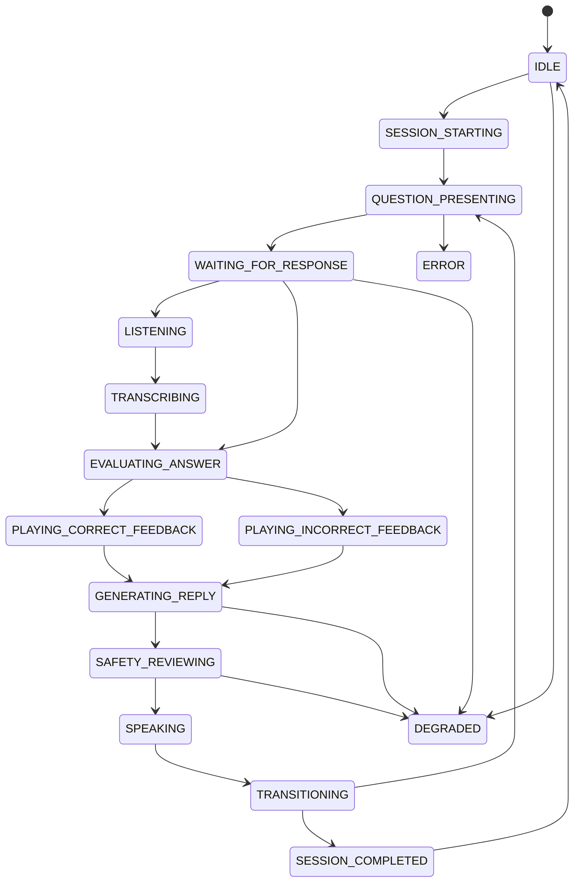

# 交互状态机 V2

本文为未来双屏、语音和动画编排状态机草案，不代表当前代码已经实现。

## 1. 状态总览

## 2. 状态定义

| 状态 | 进入条件 | 退出条件 | 可接收事件 | 超时 | 可取消 | 儿童屏表现 | 机器人屏表现 | 后端状态 | 降级行为 |
| -- | -- | -- | -- | -- | -- | -- | -- | -- | -- |
| IDLE | 无活动会话或会话结束 | 收到开始训练命令 | `SESSION_START_REQUESTED`, `CLIENT_CONNECTED` | 无 | 否 | 欢迎或课程选择 | 待机动画 | 无活动 session | 表情屏离线时只显示儿童屏 |
| SESSION_STARTING | 儿童开始训练 | 会话创建成功或失败 | `SESSION_STARTED`, `ERROR_OCCURRED` | 3s | 是 | 加载中 | 准备/问候 | 创建 session、题目队列 | 失败回到 IDLE 并提示重试 |
| QUESTION_PRESENTING | 会话有当前题 | `QUESTION_PRESENTED` 完成 | `QUESTION_PRESENTED`, `CLIENT_RECONNECTED` | 2s | 是 | 显示题目、选项、进度 | 看题/关注动画 | 发布题目事件 | 机器人屏缺失时儿童屏继续 |
| WAITING_FOR_RESPONSE | 题目展示完成 | 点击答案或开始语音 | `ANSWER_SUBMITTED`, `LISTENING_STARTED`, `TIMEOUT` | 产品待定 | 是 | 可点击/可语音 | 倾听或待机 | 等待输入 | 超时提示或转 DEGRADED |
| LISTENING | 麦克风开始采集 | 语音结束、取消或失败 | `LISTENING_FINISHED`, `VOICE_CANCELLED`, `VOICE_ERROR` | 8s 建议 | 是 | 录音状态、可停止 | 倾听动画 | 创建 voice turn | 转文字输入 |
| TRANSCRIBING | 语音段结束 | 转写完成或失败 | `TRANSCRIPT_READY`, `STT_FAILED` | 5s 建议 | 是 | 处理中 | 思考动画 | 调 STT provider | 转手动输入 |
| EVALUATING_ANSWER | 收到答案或转写答案 | 判题完成 | `ANSWER_EVALUATED` | 2s | 否 | 禁用重复提交 | 思考动画 | 判题、记录尝试 | 失败允许重试同题 |
| PLAYING_CORRECT_FEEDBACK | 答案正确 | 反馈动画/语音完成 | `FEEDBACK_REQUESTED`, `ANIMATION_FINISHED`, `TTS_FINISHED` | 4s | 是 | 正确反馈 | 表扬动画 | 记录正确和推进计划 | TTS 失败时只播动画 |
| PLAYING_INCORRECT_FEEDBACK | 答案错误 | 反馈完成或进入重试 | `FEEDBACK_REQUESTED`, `ANIMATION_FINISHED`, `TTS_FINISHED` | 4s | 是 | 错误反馈和必要提示 | 鼓励动画 | 记录错误和提示 | 审核失败用固定鼓励 |
| GENERATING_REPLY | 需要机器人语音回复 | 生成候选文本 | `LLM_REPLY_GENERATED`, `LLM_FAILED` | 8s 建议 | 是 | 等待提示 | 思考动画 | 调 LLM 或规则 provider | 回退规则回复 |
| SAFETY_REVIEWING | 有候选文本 | 通过、拒绝或超时 | `SAFETY_REVIEW_PASSED`, `SAFETY_REVIEW_REJECTED` | 800ms-2s | 否 | 等待 | 思考/安全兜底 | 审核输入/输出 | 固定安全兜底 |
| SPEAKING | 有已审核文本或音频 | 播放完成或取消 | `TTS_STARTED`, `TTS_FINISHED`, `SPEECH_INTERRUPTED` | 音频时长+2s | 是 | 字幕/禁用冲突操作 | 说话动画 | 记录播放事件 | 无音频时显示文字和说话短动画 |
| TRANSITIONING | 反馈结束且需下一题 | 下一题展示或会话完成 | `QUESTION_PRESENTED`, `SESSION_COMPLETED` | 2s | 是 | 过渡/进度更新 | 过渡动画 | 更新题目索引 | 超时后拉快照 |
| SESSION_COMPLETED | 所有题完成 | 报告生成或返回首页 | `REPORT_GENERATED`, `SESSION_ENDED` | 5s | 否 | 报告摘要 | 完成庆祝 | 生成报告 | 报告失败可重试 |
| DEGRADED | 语音、模型、动画或设备不可用 | 恢复或会话结束 | `PROVIDER_RECOVERED`, `CLIENT_RECONNECTED`, `SESSION_ENDED` | 无 | 是 | 明确降级提示 | 简化表情 | 记录降级原因 | 使用文本/规则/Mock |
| ERROR | 不可恢复错误 | 重试、重置或结束 | `RETRY_REQUESTED`, `SESSION_ENDED` | 无 | 是 | 错误提示 | 错误安抚 | 保留错误事件 | 回到快照或结束 |

## 3. 状态机规则

- 双屏不得各自独立推进核心状态。
- 后端事件是状态转换事实源。
- 儿童屏和机器人屏重连后必须从事件序列或会话快照恢复。
- 语音、模型、TTS 和动画都应允许取消，但安全审核结果不可跳过。
- 审核失败、审核超时和模型失败都不得播放候选文本。
- 行为观察事件不直接改变判题结果，只影响后续指标和报告。
