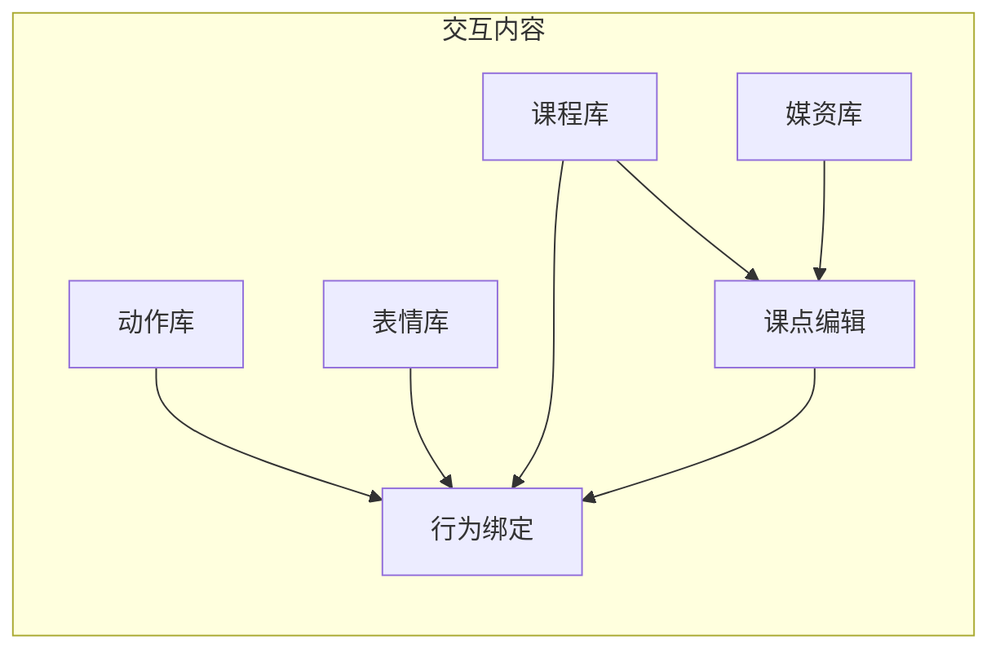

# 阶段 F · 交互内容配置 — 设计说明

> **状态：** **F-IC0→F-IC4 已落地（2026-07-16）**；剩余 F 见 [`PHASE_F_ALGO_CONFIG.md`](PHASE_F_ALGO_CONFIG.md)  
> **前端预览原型：** [`temp_robot-config-prototype/interactive-content-prototype.html`](../temp_robot-config-prototype/interactive-content-prototype.html)（浏览器直接打开）  
> **范围：** 仅「交互内容配置」；概览 / 摄像头 / 语音 / 报告权重属 F-Algo  

> **视觉参考：** [`temp_robot-config-prototype/`](../temp_robot-config-prototype/)（`CONFIG_CENTER_DESIGN_SPEC.md` + `config-center-prototype.html`）  
> **总规划入口：** [`PHASE_DEF_REQUIREMENTS.md`](PHASE_DEF_REQUIREMENTS.md) §3（本文是 F 的**优先切片**细化，不是替代整份 F）
>
> **已落地入口：** `/server/config/content`（交互内容）；根路径 `/server/config` 现重定向到 **概览**（F-Algo）；`?view=expressions|binding|motions|media|courses|workbench`；`/robot` 映射/动作库 Tab 重定向。

### 已确认决策

| # | 决策 | 结论 |
|---|------|------|
| 1 | 入口 | **配置中心侧栏「交互内容」收拢**；不做顶栏「课程 / 媒体 / 表情」三个一级 |
| 2 | 课型 | **第一版只读**；后续版本再加课型读写（文档与 UI 预留扩展点） |
| 3 | `speech_target` | **要加**（DB 字段 + 教师端下发优先用该字段，空则回退 `name`） |
| 4 | 开工顺序 | **按本文 §8：F-IC0 → F-IC1 → F-IC2 → F-IC3 → F-IC4** |
| 5 | 旧 `/robot` | **迁入后「课程映射」Tab 直接重定向到配置中心**；实时控制 / emotion 全屏页可保留 |
---

## 0. 一句话目标

把今天靠 **改 `database/app.db` + 往 `static/resources` 贴文件 + 在 `/robot` 零散维护动作映射** 才能完成的「课怎么上、机器人演什么」全部收进配置中心的 **交互内容** 工作台，做到：**上传 → 入库/落盘 → 绑定课点与行为 → 预览**，不要求运维会写 CSV/脚本。

---

## 1. 为什么单独拔高这一块

[`PHASE_DEF` §3.3](PHASE_DEF_REQUIREMENTS.md) 原 F1 侧重「分析器 YAML 可视化」（注意力/语音/报告权重）。那是**算法与评分**配置。

你指出的缺口是**内容与交互资产**配置——没有它，算法调得再好，课仍然要人肉维护。两者都应进配置中心，但：

| 切片 | 内容 | 建议顺序 |
|------|------|----------|
| **F-IC（本文）** | 课程 / 媒资 / 动作 / 表情 / 课点行为绑定 | **先做** |
| **F-Algo** | 原 §3.3 概览、摄像头、语音分析器、报告权重、高级 YAML | 后做或并行调研 |

下文只设计 **F-IC**。

---

## 2. 现状与痛点（设计约束）

### 2.1 课程与资源

| 现状 | 痛点 |
|------|------|
| `Course` / `CourseItem` / `CourseType` 在 SQLite（[`database/models.py`](../database/models.py)） | **无**课程 CRUD / 媒资上传 API |
| 文件在 [`static/resources/`](../static/resources/)（images/audios/videos/interactive/Emotions…） | 只能手工拷贝；路径约定隐式（尾 `/` = 随机抽图文件夹） |
| [`static/courses.json`](../static/courses.json) 仅空库回退 | 与真实目录易脱节 |
| 导入靠 `database/import_*.py` + CSV | 非可视化 |
| 语音比对目标 = 教师端下发的 **`item.name`** | 改显示名会改 ASR 目标；与 `media_file` / `hint_audio` 无正式绑定 |

### 2.2 动作与表情

| 现状 | 痛点 |
|------|------|
| [`/robot`](../templates/robot/control.html)：实时控制 / **动作库** / **课程映射** | 与 `/server` 配置台视觉、入口分裂 |
| 动作：JSON 导入、录制、播放、删除（`/api/robot/motions*`） | 能力较完整，适合**迁入**配置中心 |
| 映射：四级覆盖 + 每档 `praise|hint|question|silent` 绑 `{motions[], emotion}` | 已能绑表情，但表情来源是扫目录下拉 |
| 表情 GIF：[`static/resources/Emotions/`](../static/resources/Emotions/) + `GET /api/robot/emotions` | **无**表情库管理页、无上传/删除、无元数据；[`emotion_display.js`](../static/robot/js/emotion_display.js) 仍硬编码列表 |

### 2.3 与原型的关系

原型侧栏有「表情与机器人行为」，顶栏有「媒体管理 / 课程与儿童」等。本仓 F-IC 建议：**在配置中心内用一个「交互内容」一级模块收拢**，避免顶栏同时开五个入口导致工程膨胀；视觉与组件语言对齐原型，信息架构按本仓数据现实收缩。

---

## 3. 产品定位

**交互内容配置 = 训练里「孩子看见/听见什么」+「机器人演什么」的内容工作台。**

它不是：

- Session 录制上传（`/api/media`）
- 分析器 Real/Mock 切换（留给 F-Algo）
- 报告权重编辑（留给 F-Algo）
- 真机 OSC 实时录动作的完整替代（可保留「打开旧 `/robot` 实时控制」深链）

它是：

1. **课程结构**（课型 → 课程 → 课点 Item）可视化维护  
2. **媒资库**（图/音/视频/交互 HTML）上传、浏览、被课点引用  
3. **动作库 / 表情库** 资产维护  
4. **行为绑定**：课点或课程事件发生时，播哪些动作、切哪个表情（迁并增强现有课程映射）

---

## 4. 信息架构（建议）

### 4.1 全局壳（与监控共用）

```text
顶栏：实时监控 | 配置中心
配置中心左侧：
  · 交互内容          ← F-IC（本文，优先实现）
  · 配置概览          ← F-Algo（占位「规划中」）
  · 摄像头与注意力    ← 占位
  · 语音与音频        ← 占位
  · 报告与评分        ← 占位
  · 高级 / 原始 YAML  ← 可保留现有 /server 配置能力入口
```

路由建议：

- `/server` — 维持现有双 Tab，或逐步改为顶栏切换  
- `/server/config` — 配置中心壳  
- `/server/config/content` — 交互内容默认落地页  

实现栈建议与现网一致：**Jinja + 静态 JS/CSS**（对齐原型浅色运营风）；不必先上 React。

### 4.2 「交互内容」内部导航（不要硬拆成互不相关的两页）

前端**不必**只做「课程 | 表情」两个 Tab。更贴近工作流的是 **一个模块、多视图**，中间用「引用关系」串起来：

```text
交互内容
├── 工作台（概览）
├── 课程库
├── 课点编辑（课程详情钻入）
├── 媒资库
├── 动作库
├── 表情库
└── 行为绑定（课程 ↔ 动作/表情）
```

| 视图 | 用户任务 | 数据底座 |
|------|----------|----------|
| **工作台** | 看统计：课程数、Item 数、缺媒资课点、缺映射课、表情/动作数量；快捷入口 | 聚合 API |
| **课程库** | 浏览/筛选课型；新建/编辑/归档课程；进详情 | `Course` / `CourseType` |
| **课点编辑** | 维护 Item：名称、展示媒体、hint、难度、config；标语音目标 | `CourseItem` + 资源路径 |
| **媒资库** | 上传/浏览/搜索 `static/resources`；复制路径或「选用到课点」 | 文件系统 + 可选索引 |
| **动作库** | 迁自 `/robot` 动作库：列表、导入 JSON、删除、试播 | `doll/data/motions.json` + 现 API |
| **表情库** | 缩略图库、上传/删除 GIF、默认 idle、引用计数 | `Emotions/` + 扩展 API |
| **行为绑定** | 迁自 `/robot` 课程映射；表情下拉改为表情库；试触发 | `course_map.json` + 现 mapping API |

**呈现原则：**

- 从**课程**出发：课点行上可「选媒体」「配行为」→ 抽屉打开媒资库 / 绑定面板。  
- 从**资产**出发：表情/动作卡片显示「被哪些课程引用」。  
- **行为绑定**是课程与机器人资产的枢纽，不要藏在仅运维才懂的 `/robot` 里。



---

## 5. 功能需求明细

### 5.1 课程库与课点（优先级 P0）

**课程**

- 列表：按课型筛选（命名/拟声/模仿/配对/排序）；显示标题、Item 数、提问/表扬音频是否齐全、是否有行为映射。  
- 新建课程：选课型、标题、icon；可选 `question_audio` / `praise_audio` / `entry_file`（交互课）。  
- 编辑 / 软删除或归档（硬删需二次确认，并检查映射引用）。  
- **不**在第一版做多语言、多租户。

**课点 Item**

- 在课程详情内表格/卡片编辑：`name`、`type`（image/interactive）、`media_file`、`hint_audio`、`difficulty`、`config`（JSON 高级折叠）。  
- **语音目标（建议新增字段，P0.5）：** `speech_target`（可空）；空则回退 `name`（兼容现状）。UI 上明确「显示名」与「ASR 比对文本」分离，避免改名误伤匹配。  
- 媒体选择：打开媒资库选择文件或**文件夹**（保持尾 `/` 随机图语义，UI 用「文件夹·随机抽一张」标签说清楚）。  
- 批量：同课内排序（若现模型无 order 字段则先按 id/导入序，顺序字段可列为 P1）。

**课型**

- 第一版：**只读展示** 现有 5 类 `CourseType`（与报告/行为契约绑定深）。  
- **后续必做：** 课型读写（新建/改名/与前端英文映射、handler 别名、报告公式对齐）；UI 可留「课型管理（规划中）」入口，避免遗忘。  
- 第一版**禁止**随意新增课型写入 DB。

### 5.2 媒资库（优先级 P0）

- 浏览树或按类型 Tab：`images` / `audios` / `videos` / `interactive` / `Emotions`（表情也可只在表情库管）。  
- 上传：落盘到约定子目录（可按课型推荐路径，如 `resources/images/naming/{folderId}/`）；返回相对 `static/` 的路径。  
- 预览：图片缩略图、音频播放器、视频播控；文件夹显示样本数。  
- 删除：仅未引用或二次确认；引用检测扫 Course/CourseItem 路径字段。  
- **不做**第一版：复杂标签体系、与 `AudioData.csv` 自动双向同步（可只读展示 CSV 提示）。

### 5.3 动作库（优先级 P0，以迁移为主）

- 功能对齐现 `/robot` 动作库：列表、导入 v2 JSON、删除、试播、停止。  
- UI 换成配置中心视觉；API **尽量复用** `/api/robot/motions*`。  
- 「实时录制新动作」：第一版用按钮链到旧 `/robot` 实时控制 Tab，或嵌入说明「请在机器人控制页录制后再导入」——避免把 MediaPipe 录制栈整进配置中心。

### 5.4 表情库（优先级 P0，补齐缺口）

- 网格：缩略图、文件名、是否默认 idle、被映射引用次数。  
- 上传 GIF → `static/resources/Emotions/`；删除前检查 `course_map` 引用。  
- 设置默认表情（替代硬编码 `001_Eye.gif`）。  
- `emotion_display.js` 改为启动时拉 `GET /api/robot/emotions`（或配置中心同源 API），去掉硬编码列表。  
- 元数据（用途标签、随机池、冷却）：对齐原型 §9，**第一版可只做文件 + 默认 + 引用**；随机池规则 P1。

### 5.5 行为绑定（优先级 P0，迁移 + 打通表情库）

- 迁入现有四级映射 UI（默认 / 课程 / 学生-课程 / 课点）。  
- 每个 `auxType` 槽：多选动作 + **表情库选择器**（带预览）。  
- 「试触发」：调现有 `course-event` / `emotions/trigger`（标明仅预览、确认发真机——对齐原型二次确认精神，第一版可先本机 Socket）。  
- 与课程库联动：从课点行「配置行为」跳进绑定并带上 course/item 上下文。

### 5.6 工作台（优先级 P1，可薄）

- 卡片：课程数、缺提问音频、缺 Item 媒体、无行为映射的课程、表情/动作数量。  
- 链到对应列表并带 filter。

---

## 6. 界面草图（文字线框）

### 6.1 交互内容 · 工作台

```text
┌ 顶栏：实时监控 | 配置中心 ─────────────────────────┐
├ 侧栏：交互内容* | …规划中…                          │
│ ┌───────────────────────────────────────────────┐ │
│ │ 交互内容                              [工作台] │ │
│ │ [课程 4] [课点 28] [缺媒资 3] [表情 9] [动作 …]│ │
│ │ 快捷：新建课程 | 上传媒资 | 上传表情 | 行为绑定 │ │
│ └───────────────────────────────────────────────┘ │
└─────────────────────────────────────────────────────┘
```

### 6.2 课程详情 · 课点表

```text
课程：命名练习    课型：命名    [保存] [行为绑定]
提问音频：[选择…]  表扬音频：[选择…]

课点表
# | 显示名 | 语音目标 | 媒体 | hint | 操作
1 | 苹果   | 苹果    | 📁 naming/001/ | — | 选媒体 · 配行为 · 删
[ + 添加课点 ]
```

### 6.3 表情库

```text
表情库                    [上传 GIF] [设为默认]
┌────┐ ┌────┐ ┌────┐
│预览│ │预览│ │…  │
│001 │ │002 │ │   │
│引用3│ │引用0│ │   │
└────┘ └────┘ └────┘
```

### 6.4 行为绑定（沿用四级，视觉换肤）

保持现有层级选择器 + aux 四槽；表情槽改为带缩略图的选择器。

---

## 7. API / 数据建议（实现向）

### 7.1 课程（新建）

| 方法 | 路径 | 说明 |
|------|------|------|
| GET | `/api/config/courses` | 列表 + 课型 |
| POST | `/api/config/courses` | 新建 |
| GET/PATCH/DELETE | `/api/config/courses/<id>` | 详情/改/删 |
| GET/POST | `/api/config/courses/<id>/items` | 课点列表/新建 |
| PATCH/DELETE | `/api/config/items/<id>` | 改/删课点 |

写入 `database/app.db`；响应形状兼容现有 `Course.to_dict()`，避免儿童/教师端大改。

### 7.2 媒资（新建）

| 方法 | 路径 | 说明 |
|------|------|------|
| GET | `/api/config/media` | `?root=images/naming` 列出 |
| POST | `/api/config/media/upload` | multipart；指定相对目录 |
| DELETE | `/api/config/media` | 按相对路径；引用检查 |

安全：限制根在 `static/resources/` 下；禁止 `..`；限制扩展名白名单。

### 7.3 动作 / 映射（复用）

继续 `/api/robot/motions*`、`/api/robot/mapping*`；配置中心前端换皮调用即可。

### 7.4 表情（扩展）

| 方法 | 路径 | 说明 |
|------|------|------|
| GET | `/api/robot/emotions` | 已有，可增加 `referencedBy` |
| POST | `/api/robot/emotions/upload` | **新建** |
| DELETE | `/api/robot/emotions/<name>` | **新建** |
| PUT | `/api/robot/emotions/default` | **新建** |

第一版可不上 DB 表 `expression_assets`；文件系统 + JSON 映射足够。P2 再对齐原型表结构。

### 7.5 `speech_target` 字段（已确认要做）

- DB：`CourseItem.speech_target` 可空。  
- `to_dict()` 增加 `speechTarget`；教师端 `targetText` **优先**用该字段。  
- 迁移：NULL → 运行时回退 `name`（兼容旧数据）。  
- 落地子阶段：**F-IC4**（也可在 F-IC3 课点编辑 UI 先露出字段，F-IC4 接通教师端下发）。
---

## 8. 分阶段交付（仍属 F-IC，便于另一对话拆开）

| 子阶段 | 交付 | 验收要点 |
|--------|------|----------|
| **F-IC0** | 配置中心壳 + 侧栏「交互内容」+ 其它模块「规划中」；顶栏与监控互跳 | ✅ 已落地 |
| **F-IC1** | 表情库（上传/删/默认）+ 行为绑定迁入并接表情库；`emotion_display` 改拉 API；**`/robot`「课程映射」Tab 重定向到配置中心行为绑定** | ✅ 已落地 |
| **F-IC2** | 动作库迁入（复用 API）；`/robot`「动作库」Tab 可重定向或保留入口链到配置中心 | ✅ 已落地 |
| **F-IC3** | 媒资库上传浏览 + 课程/课点 CRUD + 选媒体（课型只读） | ✅ 已落地 |
| **F-IC4** | `speech_target` 接通教师端 + 工作台缺项体检 + 引用检查完善 | ✅ 已落地 |

**已确认开工顺序：** F-IC0 → F-IC1 → F-IC2 → F-IC3 → F-IC4（不并行改顺序）。
---

## 9. 明确不做（本切片）

- 完整五级覆盖 UI、Secret、模型注册、告警中心（原型其它章）  
- 分析器 / 报告权重可视化（F-Algo）  
- 多角色权限  
- 把教师控课、儿童端业务页搬进配置中心  
- 第一版任意新增「课型」写入（后续版本再开读写）  
- Session 录制隐私门控（原型「媒体与隐私」）  
- 用配置中心替代 `/robot` 实时动作录制全流程  

---

## 10. 与旧 `/robot` 的关系（已确认）

| 策略 | 说明 |
|------|------|
| **F-IC1 起** | 「课程映射」Tab → **直接重定向**到配置中心「行为绑定」（如 `/server/config/content?view=binding`） |
| **F-IC2 起** | 「动作库」Tab → 重定向到配置中心动作库，或仅留「前往配置中心」；避免两处维护 |
| **保留** | `/robot` **实时控制**、`/robot/emotion` 全屏播放页 |
| **数据** | 继续 `motions.json` / `course_map.json` / `Emotions/`，避免第一版大迁移 |
---

## 11. 验收清单（F-IC 总体）

1. 能在配置中心**上传表情**并在行为绑定中选到，课中触发与现网一致。  
2. 能在配置中心**新建课程与课点**、上传/选择图片或音频，儿童端 `/courses` 能拉到且可播放。  
3. 动作库导入/试播不回退。  
4. 媒资删除对仍被引用的路径有拦截或强确认。  
5. 监控台与配置中心顶栏互跳，互不破坏。  
6. 未做的侧栏模块显示「规划中」，不假装已接通。  
7. 更新 `UPGRADE_HANDOFF.md` + 本文状态勾选。

---

## 12. 新对话开场白（复制用）

```text
请阅读：
1) docs/PHASE_F_INTERACTIVE_CONTENT_CONFIG.md（已确认决策见文首表）
2) docs/PHASE_DEF_REQUIREMENTS.md §3
3) temp_robot-config-prototype/CONFIG_CENTER_DESIGN_SPEC.md §3、§9
4) 现有 /robot 动作库与课程映射（templates/robot、app/robot）

当前只做阶段 F「交互内容」：按 F-IC0 → F-IC1 开工。
已确认：侧栏收拢交互内容；课型 v1 只读（后续再读写）；加 speech_target（可在 IC3/IC4）；
/robot「课程映射」迁入后重定向到配置中心。不要做 F-Algo。不要推倒 motions/course_map。
先列出本子阶段页面与 API 清单（对照文档已确认项），我确认后再写代码。
```

---

## 13. 决策记录（已关闭）

原 §13 五个问题已于 **2026-07-16** 确认，见文首「已确认决策」表。实现过程中若变更，请改该表并注明日期。
