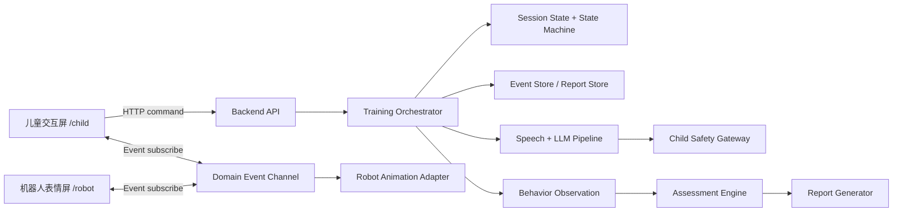
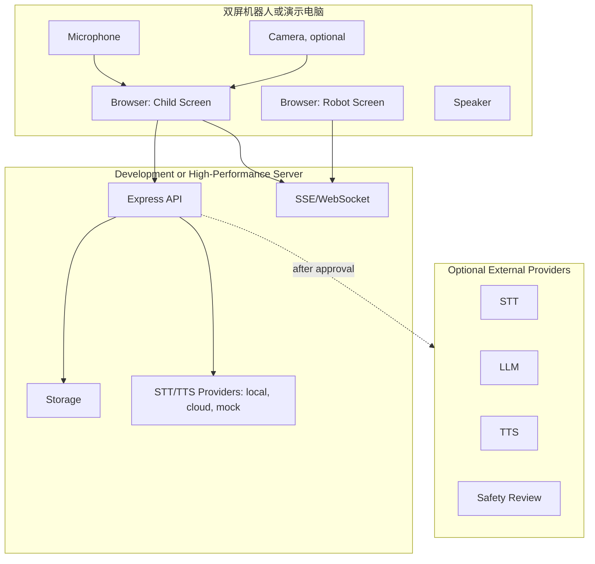

# 系统架构 V2

本文描述目标架构，不表示这些能力已经实现。当前事实以 `PROJECT_CONTEXT.md` 为准。

## 1. 当前架构

当前系统是本机 Web Demo：

- `frontend/`：React + TypeScript + Vite 单页儿童端。
- `backend/`：Express + TypeScript HTTP API。
- `matching/`、`paixu/`：课程图片素材。
- 会话和报告存于后端内存 `Map`。
- 前后端通过 HTTP JSON 通信，没有实时事件通道。
- 语音为浏览器 STT + 后端 Chat/TTS provider 雏形，默认规则回复和无 TTS。

## 2. 目标架构

目标系统包含两个独立运行页面和一个后端事实源：

- 儿童交互屏：课程、题目、作答、提示、进度、语音入口。
- 机器人表情屏：待机、倾听、思考、回答、表扬、鼓励、错误兜底动画。
- 后端训练编排：会话、题目、判题、状态机、领域事件、报告生成。
- 语音/模型服务：VAD、STT、上下文、LLM、审核、TTS、播放同步。
- 行为分析与评估：观测、特征、指标、规则版本和报告解释。
- 安全审核：输入审核、输出审核、PII 脱敏、适龄性和固定兜底。

## 3. 渐进迁移架构

1. 保留当前本机 Demo 闭环，先补文档、契约和 Mock。
2. 新增领域事件契约、状态机文档和测试基线，不改变业务代码。
3. 将双屏同步设计为后端事件驱动，先用一个 Vite 应用的两个页面验证。
4. 在 provider 接口固定后并行实现 STT/TTS/LLM Mock。
5. 在行为数据模型确认后记录观测事件，再计算指标。
6. 在安全审核网关完成前，不启用真实 LLM/TTS 面向儿童输出。

## 3.1 M4 开发阶段部署边界

当前事实：M4 开发阶段所有开发和自动化测试暂时在当前本机完成，当前本机标记为 `DEVELOPMENT_SERVER_BASELINE`。

当前事实：未来机器人设备只负责 `/child`、`/robot`、麦克风和摄像头采集、GIF 动画与音频播放；机器人端不承担 VAD、STT、TTS、视觉分析或大模型等高性能计算。

建议：M4 语音链路保持如下逻辑边界，即使当前同机运行也不得耦合到单个页面：

```text
浏览器采集端
  -> 媒体接入接口
  -> STT Provider(local/cloud/mock)
  -> 对话编排
  -> TTS Provider(local/cloud/mock)
  -> 机器人页面播放端
```

建议：未来迁移到“机器人浏览器终端 -> 局域网 -> 高性能服务器”时，应主要通过运行时配置、服务地址和部署拓扑完成，不应重写 Provider 和业务编排。

## 4. Mermaid 组件图



## 5. Mermaid 部署图



## 6. 双屏运行模式

| 方案 | 优点 | 风险 | 当前建议 |
| -- | -- | -- | -- |
| 一个 Vite 应用，两个页面 | 复用类型、API、构建和样式；迁移成本低；适合当前仓库 | 发布耦合，机器人端复杂后可能受限 | 当前阶段优先建议 |
| 两个独立前端应用 | 端边界清晰，可独立部署到不同硬件或技术栈 | 契约同步、构建、联调成本高 | 机器人屏确定为独立硬件或 SDK 后再考虑 |

当前建议依赖以下信息：两个屏幕是否同机、机器人表情资源技术形态、是否需要硬件 ACK、语音播放位置和局域网部署方式。

## 7. 后端训练编排

后端应成为唯一事实源：

- 接收命令：开始会话、展示题目、提交答案、开始语音 turn、生成报告。
- 维护状态：会话状态、当前题、语音状态、反馈状态、报告状态。
- 发布事件：所有屏幕只根据事件和快照恢复状态。
- 持久化：至少保存事件序列、报告、指标版本和安全审核结果。

## 8. 实时事件通道

当前事实：根据 `docs/PROJECT_OWNER_DECISIONS.md` 的 D-003，目标实时同步方式为 HTTP 命令与查询 + WebSocket 事件同步。WebSocket 负责双屏实时状态、训练领域事件、动画播放请求与完成回执、语音链路状态、客户端连接、断线和恢复。

事件通道要求：

- 每个事件有 `eventId`、`sessionId`、`timestamp`、`correlationId`、`causationId`、`schemaVersion`。
- 每个 session 内应有单调 `sequence` 或等价恢复机制。
- 客户端重连后使用 `lastSeenEventId`、`after` 参数或等价机制恢复缺失事件。
- 客户端按 `eventId` 幂等处理重复事件。

## 9. 语音和模型服务

语音服务拆分为 provider：

- `AudioCaptureProvider`
- `VadProvider`
- `SttProvider`
- `ConversationContextProvider`
- `LlmProvider`
- `ChildSafetyProvider`
- `TtsProvider`
- `PlaybackSyncProvider`

主模型只生成候选回复；输出通过安全审核后才能 TTS 或展示。

## 10. 行为分析

行为分析分层：

- 原始观测：题目展示、答题尝试、提示、聊天、语音、空闲、摄像头 Mock。
- 特征：首答反应时、最终用时、错误聚集、提示后恢复、求助词、离屏时长。
- 指标：题目级、窗口级、课程级。
- 报告引用：报告引用指标和算法版本，不直接引用不可追溯的模型判断。

## 11. 评估引擎

评估引擎负责确定性或可审计算法评分：

- 输入结构化观测和特征。
- 输出指标、置信度、数据质量和规则版本。
- 不由 LLM 自由生成核心分数。
- 需要专业人员提供正式阈值、权重、年龄段标准和禁用措辞。

## 12. 数据存储

目标存储至少分为：

- 会话状态存储。
- 领域事件日志。
- 行为观测和特征存储。
- 报告和导出文件存储。
- 安全审核记录和脱敏日志。

原始音视频是否保存必须由配置和产品决策控制，默认建议不保存原始音视频。

## 13. 安全审核

安全审核位于主模型前后：

1. 输入 schema 校验。
2. PII 检测与脱敏。
3. 输入内容审核和适龄性检查。
4. 主模型生成候选文本。
5. 输出审核和必要改写。
6. 失败或超时时使用固定兜底。

## 14. 模块依赖

| 上游 | 下游 | 规则 |
| -- | -- | -- |
| 领域事件契约 | 儿童屏、机器人屏、语音、行为分析 | 契约固定前不得并行实现依赖模块。 |
| Provider 接口 | STT、TTS、LLM、安全审核 | 接口固定后可并行 Mock 和真实 provider。 |
| 行为观测 | 评估引擎 | 采集和评分分开开发。 |
| 评估指标 | LLM 报告文案 | 评分完成后 LLM 才能生成解释。 |
| 安全审核 | TTS/展示 | 未通过审核不得播放或展示。 |

## 15. 故障和降级边界

| 故障 | 降级 |
| -- | -- |
| 机器人屏断线 | 儿童屏继续训练，后端记录 `CLIENT_DISCONNECTED`，机器人屏重连后用快照恢复。 |
| 事件丢失 | 客户端按 `lastSeenEventId` 拉取缺失事件；失败则拉取快照。 |
| STT 失败 | 转为手动输入或固定提示。 |
| LLM 失败 | 回退规则 provider。 |
| 审核失败或超时 | 使用固定安全兜底，不播放候选输出。 |
| TTS 失败 | 展示已审核文本，机器人屏播放无语音表情。 |
| 行为设备不可用 | 记录数据质量，不计算依赖该设备的指标。 |
