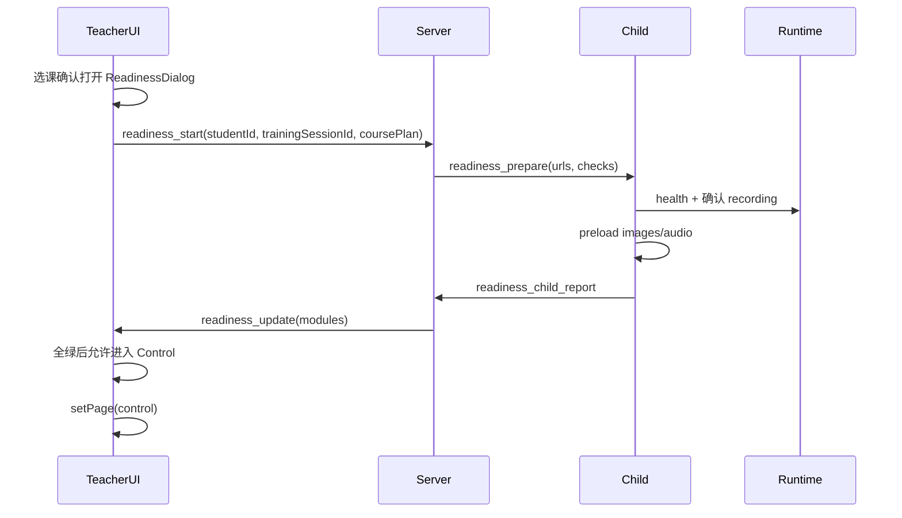

# 训练开课前就绪检查与资源预热方案

> 创建日期：2026-07-12  
> 状态：P0 已落地（2026-07-12）  
> 前置依赖：`prepare_training` 第 0 段 warmup 录制已落地（见 `docs/UPGRADE_HANDOFF.md` §2.2）  
> 本文用途：作为「选课完成 → 进入控制页」之间的就绪门（Readiness Gate）唯一实施说明；实现时按本文分阶段落地并回写验收结果。

---

## 0. 需求理解与合理性判断

### 0.1 用户要解决什么

双机联调时观察到：

- 儿童端**图片/互动页**出现较快；
- **提问/表扬等音频**往往要等较久才出声；
- 希望在教师从选课页进入控制页之前，系统先把「课点资源、音视频采集、注意力/情绪分析」等准备好；
- 希望有一个**美观的 Loading / 就绪弹窗**：分模块转圈 → 完成变对勾，下方进度条到 100%，再确认进入控制页。

同时利用已有能力：点击「开始评估/开始训练」后已开始 agent **warmup 录制**，可用这段时间的采集与（有限度的）分析可用性作为就绪依据之一。

### 0.2 结论：想法合理，建议做，但边界要收紧

| 判断 | 说明 |
|------|------|
| **合理** | 当前 `CourseSelectionPage.handleStart` → `App.handleStartCourse` **瞬时跳转**控制页；控制页挂载后约 100ms 就自动 `play_resource`，资源与分析几乎都是冷启动，音频路径又比图片多几跳，体感延迟符合现状。 |
| **值得做** | 用显式就绪门把「能进控制页」与「真能稳定开课」分开；降低首课点空白、首句提问迟迟不出的问题。 |
| **需约束** | 不能把「整场所有课点全部音频全部预解码」当成门禁（耗时、内存、随机文件夹资源无法穷举）；应做 **首课点 + 关键类型样本 + 链路健康** 的可超时、可降级门禁。 |
| **音频慢的主因（审查结论）** | 主要不是 FunASR 挡播放。播放链是：`play_resource(aux)` → `AudioService` 选型 → Socket `play_audio` → 儿童端再 HTTP 拉文件；且提问还多一轮「内容 ACK → 300ms → 再发 question」。`AudioPlayer.preloadAudio` / `child.js preloadAudio` **已存在但未接入主流程**。FunASR 冷启动主要影响分析，可能争用 CPU，但不是「等很久才播」的第一解释。 |

**建议定位：**  
「开课就绪门（Training Readiness Gate）」= **连通性 + 采集健康 + 分析管线就绪 + 首课点（及本场课型）媒体预热**，而不是无限预加载。

---

## 1. 现状审查（与本功能相关）

### 1.1 当前跳转链

```text
学生信息页「开始评估/训练」
  → prepare_training（开训练 + warmup 录制，不分析）
  → 选课页
  → 点「开始」：写 localStorage.selectedCourseItems，立刻进控制页   ← 无就绪门
  → ControlPage：fetch /courses + Socket
  → ~100ms 自动 playCurrentItem({})
  → play_resource_ack 后 ~300ms 再 playCurrentItem({ question: true })
```

关键文件：

- `teacher_frontend/App.tsx` — `handleStartCourse` 无异步门禁
- `teacher_frontend/components/CourseSelectionPage.tsx` — `handleStart`
- `teacher_frontend/components/ControlPage.tsx` — 自动 `play_resource`
- `app/sockets/handlers.py` — `PrepareTrainingHandler` / `PlayResourceHandler`
- `static/js/child.js` — `training_prepare`、`handlePlayResource`、`startRecording`
- `static/js/audio_player.js` — `preloadAudio`（未接线）

### 1.2 已有可复用信号

| 信号 | 来源 | 用途 |
|------|------|------|
| `prepare_training_ack` | 教师 Socket | 训练/warmup session 已创建 |
| `training_prepare` | 广播到儿童 | agent 已请求 `/record/start` |
| `child_agent_heartbeat` / `child_media_agent_heartbeat` | 儿童端 5s | Agent 在线 |
| `/api/server/status` | `modelStatus`、presence | 分析器配置/在线角色 |
| `/api/server/diagnostics` | `analysis_service.get_diagnostics` | 管线诊断 |
| warmup 上行帧/音频 | `/api/media/<sessionId>/...` | 「采集是否在动」（warmup **故意不** `start_session`，故不能指望 warmup 期有完整注意力入库） |
| `AudioPlayer.preloadAudio` | 儿童端 | 音频预热 |

### 1.3 明确缺口

1. 选课 → 控制零门禁。  
2. warmup **不**启动分析会话 → 「warmup 期间能否分析」不能直接等于「注意力已写入报告」；最多做 **轻量探针**（见 §4.3 / §5.3）。  
3. 音频预加载 API 未接入选课流程。  
4. 教师端收不到「儿童端 warmup 录制真正成功」的专用 ACK（只能间接用心跳 / 新事件补全）。  
5. 控制页返回选课目前**不** `cancel_prepare_training`；就绪门生命周期要与返回路径一起设计。

---

## 2. 目标与非目标

### 2.1 目标

1. 教师在选课页点击「开始训练/开始评估（进入控制）」后，**先进入就绪阶段**，不立刻挂载 ControlPage 自动开课。  
2. 就绪阶段并行检查并尽量预热下列模块（见 §3），UI 分项展示状态。  
3. **全部必选模块成功**（或达配置的「可继续」策略）后，进度条 100%，出现「进入控制」按钮。  
4. 进入控制页后，首课点 `play_resource` / 提问音频应明显更快、更稳（预热命中）。  
5. 失败项可重试；超时有明确文案；允许「高级：仍要进入」（可选，默认关闭或需二次确认）。

### 2.2 非目标（本批次不做）

- 不预加载本场**全部**课点子项的全部随机媒体（文件夹随机图无法预知最终 `resolvedFile`）。  
- 不在就绪门内完整跑完整场 Real ASR/注意力训练（过重）。  
- 不替代阶段 D Server 监控台（可复用信号，但不做运营盯盘 UI）。  
- 不改变课中评分、报告公式、配对/排序游戏逻辑。

---

## 3. 详细功能需求

### 3.1 插入点与状态机

**推荐插入点：**  
`CourseSelectionPage` 确认选课 → `App` 层打开就绪门 → 全部通过 → 再 `setCurrentPage('control')`。  
**不要**先进入 ControlPage 再挡（否则 100ms 自动 play 已触发）。

```text
选课确认
  → GateOpen(selectedCourses, selectedItems, trainingSessionId, studentId)
  → 并行跑 CheckModules
  → AllRequiredPass
  → 用户点「进入控制界面」
  → 挂载 ControlPage（携带 readinessToken / 已预热标记）
  → 首课点 play 可跳过部分冷启动
```

取消：

- 关闭就绪门 / 「返回选课」：停止进行中的 preload 任务；**不**默认 cancel warmup（warmup 从「开始评估」起算，仍保留）；仅取消本轮 gate。  
- 若用户从选课返回学生信息：沿用现有 `cancel_prepare_training`。

### 3.2 检查模块（产品层）

下列模块与 UI 一一对应。实现时可合并后端探针，但 UI 仍建议分项展示。

| ID | 模块名称 | 必选？ | 通过条件（建议） | 失败表现 |
|----|----------|--------|------------------|----------|
| `M1` | 连接与在线 | 是 | 教师 Socket 已连；儿童端 presence 在线（`childOnline≥1`）；agent 模式下 Media/Robot Agent heartbeat 在线或 `/health` OK | 红叉 +「请确认儿童端已打开 / Runtime 已启动」 |
| `M2` | 音视频采集 | 是（agent） | warmup session 仍在；儿童端回报「录制中」或最近 N 秒有帧/音频上行 meta；browser 模式则本机 getUserMedia 可用 | 「摄像头/麦克风未就绪」 |
| `M3` | 注意力分析 | 是* | 服务端 Vision 管线 `initialized` / diagnostics 无致命错误；可选：对 warmup 最近一帧做一次 **probe-only** 分析成功（不写报告窗口） | 「注意力模型未就绪」 |
| `M4` | 情绪分析 | 建议「软必选」 | 与注意力同源 RealAttention 情绪字段可用，或显式 Mock/降级标记为 DEGRADED 仍可进 | 警告色勾选「已降级」 |
| `M5` | 课程清单 | 是 | `/courses` 已含所选 courseId/itemId；儿童端 `coursesReady` ACK | 「课程配置未同步」 |
| `M6` | 图片/互动资源 | 是 | 对**首课点**及可选「本场每种课型各取 1 个样本」做 HEAD/GET 预取成功（互动页 HTML 可 HEAD） | 「资源文件缺失」列出路径 |
| `M7` | 音频资源 | 是 | 按 `audio_manifest` 为本场涉及的 `courseType` 解析 question/praise/hint 默认条目；儿童端 `preloadAudio` 全部 `canplaythrough` 或超时策略 | 「语音未预热」——这是改善「音频很慢」的核心项 |

\* 若配置为 Mock 且团队接受联调降级，可将 M3 标为软必选；生产 agent+real 应为硬必选。

### 3.3 进度与完成规则

- 进度条 = `加权完成数 / 总权重`（默认等权；M7/M2 可略高）。  
- 单项状态：`pending | running | success | degraded | failed`。  
- **进入控制**按钮：所有硬必选为 `success` 或 `degraded`（若允许降级）且无 `running`。  
- 总超时建议：**20–45s**（可配置）；超时未完成 → 失败项标红，允许重试该模块 / 全部重试。  
- 「仍要进入」：仅当环境开关或设置项开启；需二次确认，并在控制页顶部显示「未完全就绪」条。

### 3.4 与 warmup / 分析的关系（重要）

当前 warmup **故意不** `analysis_service.start_session`，因此：

- **不能**要求「warmup 期间报告里已有注意力曲线」才算 M3 通过。  
- **可以**：
  1. 用上行 meta / Agent 状态证明采集在跑（M2）；  
  2. 新增轻量 `readiness_probe`：临时对 warmup session 启 **probe 模式分析**（只跑 1–几帧注意力，结果回 ACK，不 `open_window` / 不污染课点指标）；或  
  3. 仅检查服务端 analyzer `is_initialized`（较弱，但实现快）。

**推荐实现顺序：** P0 用 (1)+(3)；P1 再做 (2) probe。

### 3.5 进入控制页后的行为变更

- ControlPage 收到 `readinessPassed=true` 时：  
  - 可略缩短首次自动 play 前 delay（或保持 100ms）；  
  - 提问音频优先走已 preload 的 `AudioPlayer` 缓存；  
  - 若预热时已拿到首课点 `resolvedFile` 候选，可把路径写入 sessionStorage（可选）。  
- **不要**在 gate 阶段对儿童端播放可听得见的提问/表扬（静默 preload only）。

---

## 4. 前端设计

### 4.1 视觉原则（对齐现有教师端）

参考：`StudentInfoPage` / `TeacherRatingDialog` / 控制页——浅灰底 `bg-gray-50`、靛蓝主色 `indigo-600`、白卡片圆角阴影、Lucide 图标；**不要**做成炫酷游戏风或深色赛博风。

### 4.2 组件建议

新建：`teacher_frontend/components/TrainingReadinessDialog.tsx`

结构示意：

```text
┌─────────────────────────────────────────────┐
│  开课准备                                    │
│  正在确认设备、资源与分析是否就绪…            │
│                                             │
│  ✓  连接与在线          已完成               │
│  ✓  音视频采集          已完成               │
│  ⟳  注意力分析          检测中…              │
│  ⟳  情绪分析            检测中…              │
│  ✓  课程清单            已完成               │
│  ⟳  图片与互动资源      3/5                  │
│  ⟳  语音资源预热        1/4                  │
│                                             │
│  ████████████░░░░  62%                      │
│  预计还需约 8 秒                             │
│                                             │
│  [ 返回选课 ]          [ 进入控制界面 ]      │
└─────────────────────────────────────────────┘
```

细节：

- 遮罩：半透明 + 轻度 blur（与评分弹窗一致）。  
- 卡片：白底、约 520–640px 宽，圆角 `rounded-2xl`，`shadow-xl`。  
- 每行：左侧状态图标（`Loader2` spin / `CheckCircle2` 绿 / `AlertTriangle` 琥珀降级 / `XCircle` 红）、标题、右侧短状态文案。  
- 进度条：启用现有 `teacher_frontend/components/ui/progress.tsx`。  
- 「进入控制界面」：主按钮 indigo；未就绪时 `disabled`。  
- 失败行可点「重试」。  
- Android 横屏：单列列表可滚动，进度条与按钮固定在卡片底部。

### 4.3 文案（中文）

| 状态 | 示例 |
|------|------|
| 标题 | 开课准备 |
| 副标题 | 请稍候，正在确认机器人采集、分析与本场课程资源 |
| 成功副文 | 全部就绪，可以开始上课 |
| 超时 | 部分项目仍未完成，可重试或检查儿童端与 Runtime |
| 强制进入警告 | 未完全就绪，首课语音或分析可能延迟 |

### 4.4 动效

- 列表项完成：转圈 → 对勾，轻微 scale（150–200ms）。  
- 进度条平滑过渡。  
- 全部完成时主按钮启用，可轻脉冲一次（克制）。

---

## 5. 技术实现规划

### 5.1 总体架构



### 5.2 建议新增契约

#### Socket（推荐主路径）

| 事件 | 方向 | 载荷要点 |
|------|------|----------|
| `readiness_start` | 教师→服务器 | `studentId`, `trainingSessionId`, `items:[{courseId,itemId,courseType}]`, `firstItem`, `mediaMode` |
| `readiness_update` | 服务器→教师 | `moduleId`, `status`, `detail`, `progress01` |
| `readiness_prepare` | 服务器→儿童 | `sessionId`, `assetUrls[]`, `audioUrls[]`, `requireRecording:true` |
| `readiness_child_report` | 儿童→服务器 | 各子检查结果、preload 完成数 |
| `readiness_complete` | 服务器→教师 | 汇总 `modules`, `ok`, `degraded[]` |
| `readiness_cancel` | 教师→服务器 | 取消本轮 |

#### HTTP（可选补充）

- `POST /api/training/readiness/plan`：根据选课返回待预热 URL 列表（解析 `audio_manifest` + DB media 路径）。  
- 继续复用 `GET /api/server/status`、`GET /api/server/diagnostics`。

### 5.3 后端实现要点

1. **ReadinessService**（建议新建 `app/services/readiness_service.py`）：聚合 presence、media meta、diagnostics、儿童报告。  
2. **资源计划**：输入选课列表 → 输出  
   - 图片/互动：item.file / course.file；若是文件夹，抽样 1 个文件做可达性检查（标注 `sampled`）。  
   - 音频：对每个涉及的 `courseType` 调 `AudioSelector.select_for_course` 得到 question/praise/hint 路径（与正式播放同源）。  
3. **Probe（P1）**：`analysis_service.probe_attention(session_id)` —— 短时处理 1 帧，不注册课点触发器。  
4. **幂等**：同一 `trainingSessionId` 重复 `readiness_start` 取消旧任务。

### 5.4 儿童端实现要点

1. 监听 `readiness_prepare`：确认录制中；预取图片；`AudioPlayer.preloadAudio`；回报进度。  
2. **静默**：preload 禁止出声（勿 `play()`，或 volume=0 立即 pause）。  
3. browser 模式：检查 `mediaStream` track `readyState`。

### 5.5 教师端实现要点

1. `App.tsx`：`handleStartCourse` 改为打开 Gate，成功后再 `setCurrentPage('control')`。  
2. 新组件 `TrainingReadinessDialog`；简单 `useReducer` 即可。  
3. ControlPage：接受 `readinessContext`；自动 play 逻辑可保持，依赖儿童缓存加速。  
4. 样式：Tailwind + Lucide；Dialog 可用 Radix（与评分弹窗一致）。

### 5.6 与 prepare_training 的衔接

| 阶段 | 已有 | Gate 增量 |
|------|------|-----------|
| 点「开始评估」 | 开 warmup 录制 | 无 |
| 选课中 | 录制继续 | 可攒上行 meta |
| 点「开始上课」 | （无） | **Gate** |
| 进控制 | 首 play 切 warmup→课点段 | 预热缓存加速同路径文件 |

### 5.7 分阶段实施（给新对话用）

#### P0（先打通门禁与最大痛点）

- [x] UI 弹窗 + 模块状态 + 进度条  
- [x] M1 连接、M5 课程清单、M2 采集（heartbeat + 录制中）  
- [x] M7 音频预热（儿童 `preloadAudio`）  
- [x] M6 首课点图片预取  
- [x] 全绿后进入控制；失败可重试  
- [x] 回写本文验收  

#### P1

- [x] M3/M4 diagnostics + 可选 attention probe（已用 `probe_attention` 单帧探针；需返回分数/情绪才过）  
- [x] 降级态、超时、强制进入开关（M4 已支持 degraded；弹窗超时/失败可强制进入）  
- [x] `readiness_child_report` 正式补齐 warmup 成功回传（含 probeFrame / audioPlayOk）  
- [x] 自动化测试  

#### P2

- [ ] 按课型批量预热更多音频（设上限 N）  
- [ ] 控制页「未完全就绪」提示条  
- [ ] 与阶段 D 监控字段对齐（可选）
- [ ] 根治 agent 空 AVI/WAV 落盘（Gate 已能检出无帧，但上传链路仍需单独修）

**偏差/补强记录（2026-07-12）：**
- M3/M4 纳入硬门禁：`probe_attention` 单帧探针需返回注意力分数；情绪可 `degraded`。
- M7 必须儿童端点击解锁后 unmuted 试播成功（修复 `NotAllowedError` 假绿）。
- M2 需探针帧/实际上行，禁止仅凭 `recording=true`。
- presence：`client_presence` 10s 心跳。
- 总超时 45s。
- **M3/M4 超时假失败（2026-07-12 复盘）**：注意力只挂在窗口分析，原探针误走 `process_realtime` 永远无结果；且儿童端 canvas 抓帧失败时无 `probeFrame` 会一直「等待」到超时。现改为直接 `analyze_frame`，并用实际上行缓存帧做服务端探针。
- **课中无注意力/空课点 AVI（2026-07-13）**：`play_resource` 先写 `currentSessionId` 再 `startRecording`，导致 warmup→课点切换时 Media Agent 未 `/record/stop`+`/record/start`，帧继续写进 warmup 目录；课点 session 空壳且 analysis 无帧。已修切换顺序；M3 要求检出人脸；Gate「进入」仅全模块真实通过，超时/失败可「强制进入」。

### 5.8 测试与验收

**自动：** `tests/test_readiness_service.py` — 资源 plan 非空；失败→重试→成功；同 trainingSessionId 幂等取消旧任务。  

**手工（双机）：**

1. agent 在线：Gate 全绿 → 进控制 → **首句提问明显快于改前**。  
2. 关掉 Runtime：M1/M2 失败，不能进入。  
3. 缺音频文件：M7 失败并显示路径。  
4. 返回选课再进：Gate 可重跑。  
5. warmup 目录持续增长，证明 Gate 期间采集仍工作。

---

## 6. 风险与对策

| 风险 | 对策 |
|------|------|
| 文件夹随机图预热文件 ≠ 正式 `resolvedFile` | Gate 只做「目录/抽样可达」；正式仍随机 |
| 预热过多占内存 | 限制数量与总字节；复用 AudioPlayer LRU |
| Gate 过久 | 超时 + 分项重试；P0 不做重 probe |
| 与自动 play 竞态 | 未就绪禁止进控制页 |
| DB `course.question` 与 manifest 双轨 | 预热路径与 `AudioService` **同一选型** |
| 误以为「情绪已进报告」 | 文案写清：就绪=模型/链路可用 |

---

## 7. 建议改动文件清单（实现时）

| 文件 | 改动 |
|------|------|
| `teacher_frontend/App.tsx` | 选课后打开 Gate |
| `teacher_frontend/components/TrainingReadinessDialog.tsx` | **新建** UI |
| `teacher_frontend/components/CourseSelectionPage.tsx` | 可选：开始按钮 loading |
| `teacher_frontend/components/ControlPage.tsx` | 接收 readiness 上下文 |
| `static/js/child.js` | `readiness_prepare` / 进度回报 |
| `static/js/audio_player.js` | preload Promise 化、静默 |
| `app/sockets/events.py` / `handlers.py` | readiness 事件 |
| `app/services/readiness_service.py` | **新建** |
| `app/audio/*` | 导出 plan URLs |
| `tests/test_readiness_*.py` | 新建 |
| `docs/UPGRADE_HANDOFF.md` | 实现后追加契约 |
| 本文 | 实现中更新勾选与偏差 |

---

## 8. 给新对话的开场提示词（可复制）

```text
请阅读：
1) docs/TRAINING_READINESS_GATE_PLAN.md（本文）
2) docs/UPGRADE_HANDOFF.md（prepare_training / warmup 契约）
3) teacher_frontend/App.tsx、CourseSelectionPage、ControlPage
4) static/js/child.js、static/js/audio_player.js
5) app/sockets/handlers.py（PrepareTrainingHandler）

当前要做：开课就绪门 P0（选课→控制页之间的 Loading 弹窗 + 连接/采集/课程/图片/音频预热）。

约束：
- 不要先进入 ControlPage 再挡；Gate 通过后再 setPage(control)
- 音频预热必须走与正式播放相同的 manifest 选型
- warmup 不要改成默认 start_session；分析就绪 P0 可用 diagnostics
- 保持教师端现有 indigo/灰白视觉；复用 Lucide + Progress
- 完成后更新本文勾选与 UPGRADE_HANDOFF 短述
```

---

## 9. 总结

用户想法**合理且应做**：现状是「未就绪就开课」，音频冷路径可解释「图快声慢」。  
正确做法是做成**可超时、可降级、以首课点与链路健康为主的就绪门**，并用已有 warmup 采集支撑「采集是否正常」；分析用 diagnostics/探针，而不是要求 warmup 已有报告曲线。  
前端用分模块 Loading→对勾 + 底栏进度条，贴合现有教师端风格；技术上以 Socket readiness 事件 + 儿童端 `preloadAudio` 接线为主，插入点在 `App.handleStartCourse` 之前。
